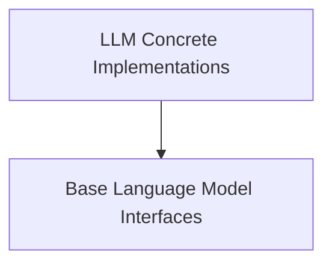

# `language_model_interfaces` Module Documentation

## Introduction
This module defines the core interfaces and abstract base classes for interacting with various language models within the system. It provides a foundational structure for both general-purpose language models and specific Large Language Model (LLM) implementations, ensuring a consistent approach to prompt generation, response handling, and token management.

## Architecture Overview
The `language_model_interfaces` module is structured around a foundational abstract base class that establishes common functionalities, and a concrete interface for custom LLM implementations. This layered approach ensures extensibility and adherence to a unified set of interaction patterns.

## Sub-modules:

*   **[Base Language Model Interfaces](base_interfaces.md)**:
    This sub-module defines the abstract `BaseLanguageModel` class, which serves as the fundamental interface for all language model wrappers. It establishes essential properties like caching, verbosity, callbacks, and abstract methods for generating prompts and managing token counts.
*   **[LLM Concrete Implementations](llm_implementations.md)**:
    This sub-module provides the `LLM` class, a simplified interface for developers to implement custom Large Language Models. It focuses on the core logic for synchronous and asynchronous text completion, allowing for tailored LLM integrations while adhering to the `BaseLLM` contract.

<!-- DIAGRAM_JSON
{
    "direction": "TD",
    "nodes": [
        {"id": "base_interfaces", "label": "Base Language Model Interfaces", "type": "module", "link": "base_interfaces.md"},
        {"id": "llm_implementations", "label": "LLM Concrete Implementations", "type": "module", "link": "llm_implementations.md"}
    ],
    "edges": [
        {"source": "llm_implementations", "target": "base_interfaces"}
    ],
    "groups": []
}
-->

