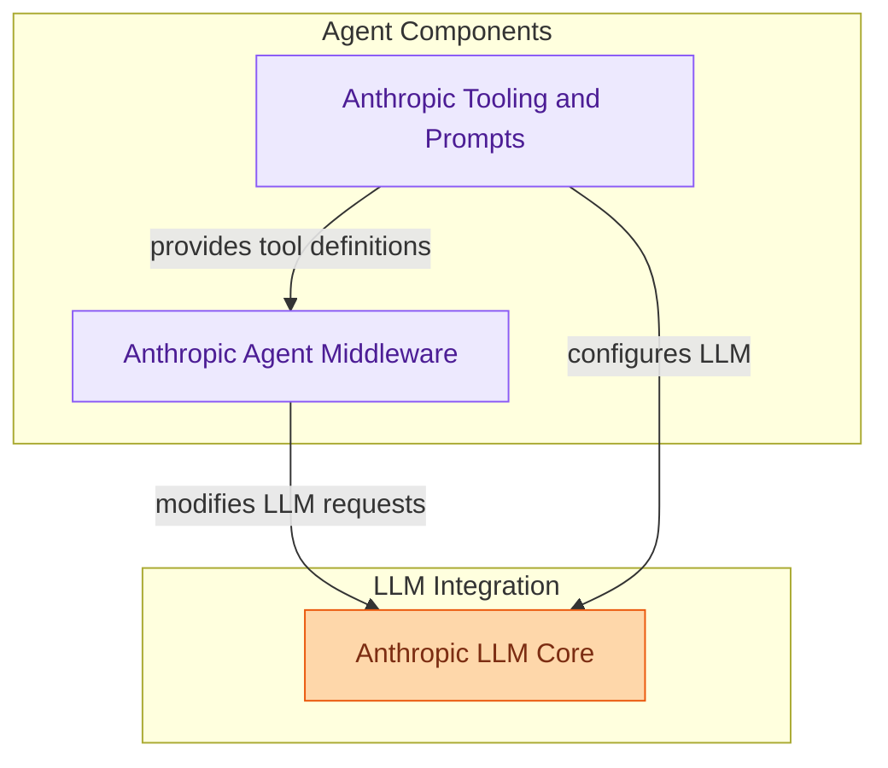

# Anthropic Partner Integration
This module provides integration with Anthropic models, offering core LLM functionalities, experimental tooling utilities for XML-to-tool calls and system message generation, and various middleware for agent development, including state management, file search, and prompt caching.

<!-- DIAGRAM_JSON
{
    "direction": "TD",
    "nodes": [
        {
            "id": "libs_partners_anthropic",
            "label": "Anthropic Partner Integration",
            "type": "module"
        },
        {
            "id": "llm_core",
            "label": "Anthropic LLM Core",
            "type": "module",
            "link": "llm_core.md"
        },
        {
            "id": "tooling_and_prompts",
            "label": "Anthropic Tooling and Prompts",
            "type": "module",
            "link": "tooling_and_prompts.md"
        },
        {
            "id": "agent_middleware",
            "label": "Anthropic Agent Middleware",
            "type": "module",
            "link": "agent_middleware.md"
        }
    ],
    "edges": [
        {
            "source": "tooling_and_prompts",
            "target": "agent_middleware",
            "label": "provides tool definitions"
        },
        {
            "source": "agent_middleware",
            "target": "llm_core",
            "label": "modifies LLM requests"
        },
        {
            "source": "tooling_and_prompts",
            "target": "llm_core",
            "label": "configures LLM"
        }
    ],
    "groups": [
        {
            "id": "llm_integration",
            "label": "LLM Integration",
            "role": "generative",
            "nodes": [
                "llm_core"
            ]
        },
        {
            "id": "agent_components",
            "label": "Agent Components",
            "role": "analytical",
            "nodes": [
                "tooling_and_prompts",
                "agent_middleware"
            ]
        }
    ]
}
-->
