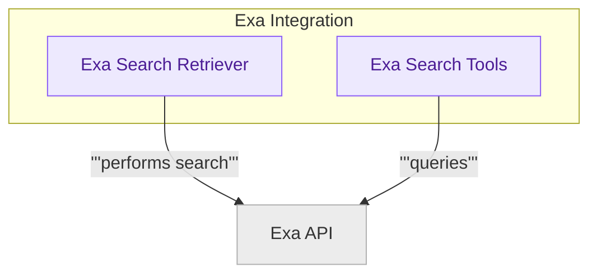

# Exa Partner Integration

This module integrates with the Exa API to provide advanced web search capabilities, offering a retriever for document retrieval and dedicated tools for searching and finding similar web pages within AI applications.

<!-- DIAGRAM_JSON
{
    "direction": "TD",
    "nodes": [
        {"id": "exa_retrievers", "label": "Exa Search Retriever", "type": "module", "link": "exa_retrievers.md"},
        {"id": "exa_tools", "label": "Exa Search Tools", "type": "module", "link": "exa_tools.md"},
        {"id": "exa_api", "label": "Exa API", "type": "external"}
    ],
    "edges": [
        {"source": "exa_retrievers", "target": "exa_api", "label": "performs search"},
        {"source": "exa_tools", "target": "exa_api", "label": "queries"}
    ],
    "groups": [
        {"id": "exa_integration_group", "label": "Exa Integration", "role": "analytical", "nodes": ["exa_retrievers", "exa_tools"]}
    ]
}
-->
