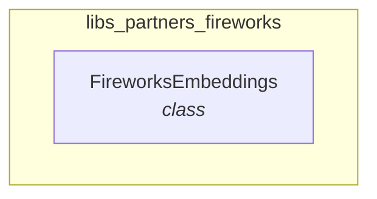

# libs_partners_fireworks
This module provides the `FireworksEmbeddings` class for integrating Fireworks embedding models into applications.

<!-- DIAGRAM_JSON
{
    "nodes": [
        {
            "id": "FireworksEmbeddings",
            "label": "FireworksEmbeddings",
            "type": "class"
        }
    ],
    "edges": [],
    "groups": [
        {
            "id": "libs_partners_fireworks",
            "label": "libs_partners_fireworks",
            "nodes": [
                "FireworksEmbeddings"
            ]
        }
    ]
}
-->
