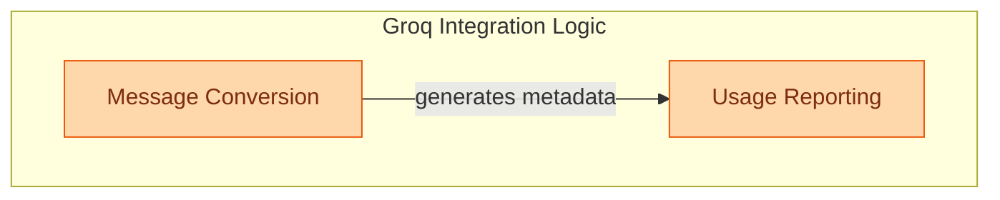

# Groq Chat Model Integration

This module provides core utilities for integrating Groq chat models, focusing on efficient message format conversions and accurate usage metadata extraction for seamless interaction with the Groq API.

<!-- DIAGRAM_JSON
{
    "direction": "TD",
    "nodes": [
        {
            "id": "libs_partners_groq",
            "label": "Groq Chat Model Integration",
            "type": "module"
        },
        {
            "id": "groq_message_conversion",
            "label": "Message Conversion",
            "type": "module",
            "link": "groq_message_conversion.md"
        },
        {
            "id": "groq_usage_reporting",
            "label": "Usage Reporting",
            "type": "module",
            "link": "groq_usage_reporting.md"
        }
    ],
    "edges": [
        {
            "source": "groq_message_conversion",
            "target": "groq_usage_reporting",
            "label": "generates metadata"
        }
    ],
    "groups": [
        {
            "id": "groq_integration_logic",
            "label": "Groq Integration Logic",
            "role": "generative",
            "nodes": [
                "groq_message_conversion",
                "groq_usage_reporting"
            ]
        }
    ]
}
-->
