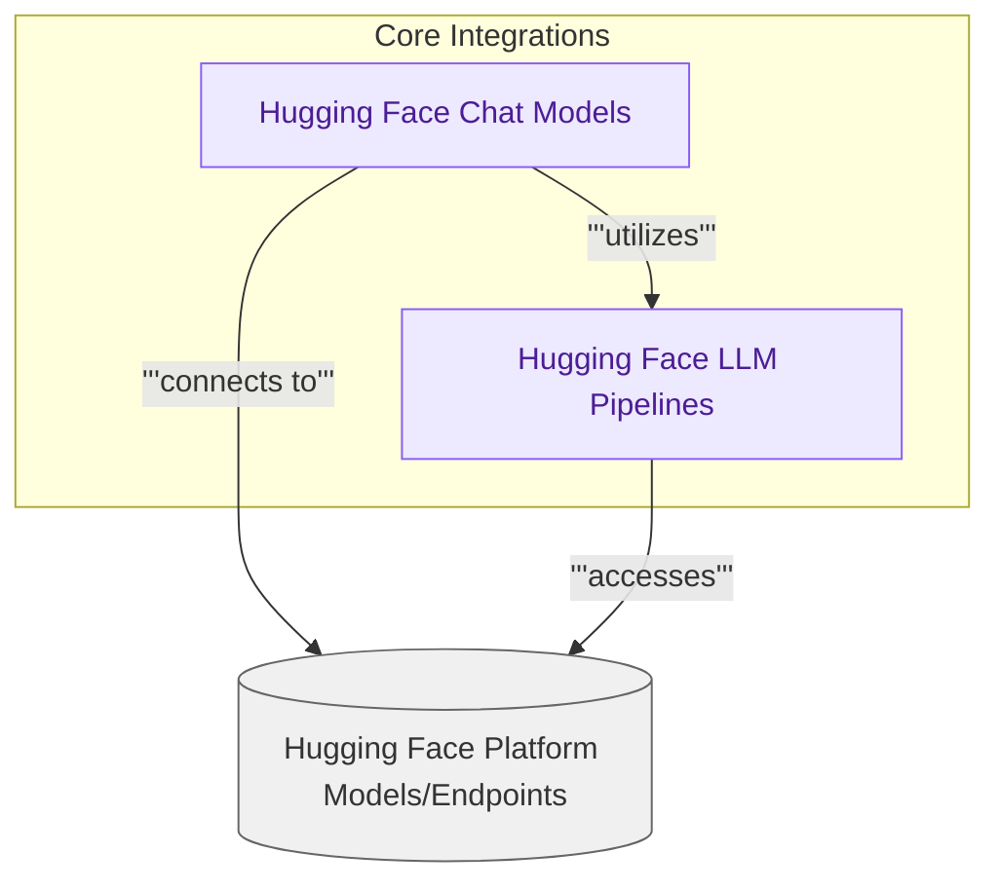

# Hugging Face Integrations

This module provides robust integrations with Hugging Face models, offering both a high-level chat interface (`ChatHuggingFace`) and a direct pipeline interface (`HuggingFacePipeline`) for diverse NLP tasks and conversational AI applications.

<!-- DIAGRAM_JSON
{
    "direction": "TD",
    "nodes": [
        {
            "id": "libs_partners_huggingface",
            "label": "Hugging Face Integrations",
            "type": "module"
        },
        {
            "id": "huggingface_chat_models",
            "label": "Hugging Face Chat Models",
            "type": "module",
            "link": "huggingface_chat_models.md"
        },
        {
            "id": "huggingface_llm_pipelines",
            "label": "Hugging Face LLM Pipelines",
            "type": "module",
            "link": "huggingface_llm_pipelines.md"
        },
        {
            "id": "external_hf_models",
            "label": "Hugging Face Platform Models/Endpoints",
            "type": "external"
        }
    ],
    "edges": [
        {
            "source": "huggingface_chat_models",
            "target": "huggingface_llm_pipelines",
            "label": "utilizes"
        },
        {
            "source": "huggingface_chat_models",
            "target": "external_hf_models",
            "label": "connects to"
        },
        {
            "source": "huggingface_llm_pipelines",
            "target": "external_hf_models",
            "label": "accesses"
        }
    ],
    "groups": [
        {
            "id": "core_integrations",
            "label": "Core Integrations",
            "role": "analytical",
            "nodes": [
                "huggingface_chat_models",
                "huggingface_llm_pipelines"
            ]
        },
        {
            "id": "huggingface_platform",
            "label": "Hugging Face Platform",
            "role": "external",
            "nodes": [
                "external_hf_models"
            ]
        }
    ]
}
-->
