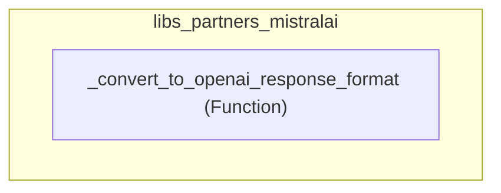

# libs_partners_mistralai
This module provides utilities for integrating Mistral AI models, specifically handling the conversion of output schemas to an OpenAI-compatible response format.

<!-- DIAGRAM_JSON
{
    "nodes": [
        {
            "id": "libs_partners_mistralai",
            "label": "libs_partners_mistralai",
            "type": "module"
        },
        {
            "id": "_convert_to_openai_response_format",
            "label": "_convert_to_openai_response_format",
            "type": "function"
        }
    ],
    "edges": [
        {
            "source": "libs_partners_mistralai",
            "target": "_convert_to_openai_response_format",
            "type": "contains"
        }
    ],
    "groups": []
}
-->
