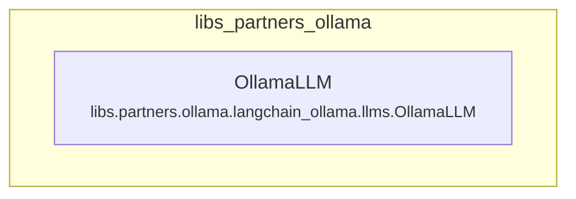

# libs_partners_ollama
This module provides the `OllamaLLM` class, an interface for interacting with Ollama large language models, supporting generation, streaming, and asynchronous operations.

<!-- DIAGRAM_JSON
{
  "nodes": [
    {"id": "libs_partners_ollama", "label": "libs_partners_ollama", "type": "module"},
    {"id": "OllamaLLM", "label": "OllamaLLM", "type": "component", "path": "libs.partners.ollama.langchain_ollama.llms.OllamaLLM"}
  ],
  "edges": [],
  "groups": [
    {"id": "libs_partners_ollama", "label": "libs_partners_ollama", "nodes": ["OllamaLLM"]}
  ]
}
-->
