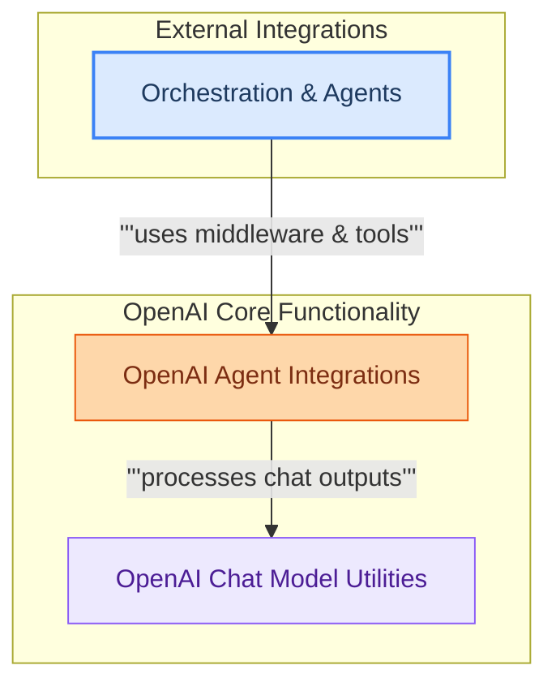

# OpenAI Partner Integration
This module provides core utilities for integrating with OpenAI services, including chat model output parsing, usage metadata generation, agent moderation middleware, and custom tool creation for enhanced LLM applications.

<!-- DIAGRAM_JSON
{
    "direction": "TD",
    "nodes": [
        {
            "id": "libs_partners_openai",
            "label": "OpenAI Partner Integration",
            "type": "module"
        },
        {
            "id": "openai_chat_utilities",
            "label": "OpenAI Chat Model Utilities",
            "type": "module",
            "link": "chat_model_utilities.md"
        },
        {
            "id": "openai_agent_integrations",
            "label": "OpenAI Agent Integrations",
            "type": "module",
            "link": "openai_agent_integrations.md"
        },
        {
            "id": "orchestration_agents",
            "label": "Orchestration & Agents",
            "type": "external",
            "link": "orchestration_and_agents.md"
        },
        {
            "id": "chat_model_utilities",
            "label": "OpenAI Chat Model Utilities",
            "type": "module",
            "link": "chat_model_utilities.md"
        }
    ],
    "edges": [
        {
            "source": "orchestration_agents",
            "target": "openai_agent_integrations",
            "label": "uses middleware & tools"
        },
        {
            "source": "openai_agent_integrations",
            "target": "openai_chat_utilities",
            "label": "processes chat outputs"
        },
        {
            "source": "libs_partners_openai",
            "target": "chat_model_utilities"
        }
    ],
    "groups": [
        {
            "id": "openai_core_func",
            "label": "OpenAI Core Functionality",
            "role": "generative",
            "nodes": [
                "openai_chat_utilities",
                "openai_agent_integrations"
            ]
        },
        {
            "id": "external_systems",
            "label": "External Integrations",
            "role": "surface",
            "nodes": [
                "orchestration_agents"
            ]
        }
    ]
}
-->
