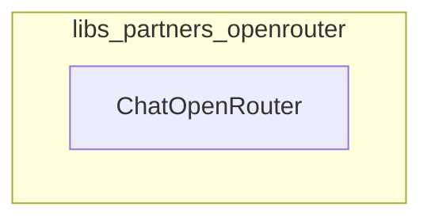

# libs_partners_openrouter
This module provides the `ChatOpenRouter` class, an integration for OpenRouter's unified API, allowing access to various chat models from multiple providers.

<!-- DIAGRAM_JSON
{
    "nodes": [
        {
            "id": "libs_partners_openrouter",
            "label": "libs_partners_openrouter",
            "type": "module"
        },
        {
            "id": "libs.partners.openrouter.langchain_openrouter.chat_models.ChatOpenRouter",
            "label": "ChatOpenRouter",
            "type": "class"
        }
    ],
    "edges": [],
    "groups": []
}
-->
