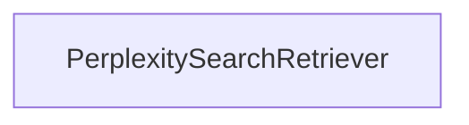

# libs_partners_perplexity
This module provides the `PerplexitySearchRetriever`, a LangChain-compatible retriever that leverages the Perplexity Search API to fetch relevant documents based on a query and various search parameters. It allows for filtering by country, domain, recency, and date ranges.

<!-- DIAGRAM_JSON
{
  "nodes": [
    {
      "id": "libs.partners.perplexity.langchain_perplexity.retrievers.PerplexitySearchRetriever",
      "label": "PerplexitySearchRetriever",
      "metadata": {
        "type": "class"
      }
    }
  ],
  "edges": [],
  "groups": []
}
-->

