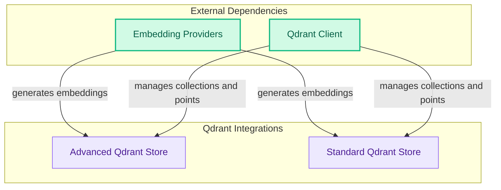

# Qdrant Partner Integration
This module integrates with Qdrant, providing advanced and standard vector store implementations for efficient document indexing, similarity search, and maximal marginal relevance (MMR) search with support for dense, sparse, and hybrid embeddings.

<!-- DIAGRAM_JSON
{
    "direction": "TD",
    "nodes": [
        {"id": "qdrant_vector_store_advanced", "label": "Advanced Qdrant Store", "type": "module", "link": "qdrant_vector_store_advanced.md"},
        {"id": "qdrant_vector_store_standard", "label": "Standard Qdrant Store", "type": "module", "link": "qdrant_vector_store_standard.md"},
        {"id": "qdrant_client", "label": "Qdrant Client", "type": "external"},
        {"id": "embedding_providers", "label": "Embedding Providers", "type": "external"}
    ],
    "edges": [
        {"source": "embedding_providers", "target": "qdrant_vector_store_advanced", "label": "generates embeddings"},
        {"source": "embedding_providers", "target": "qdrant_vector_store_standard", "label": "generates embeddings"},
        {"source": "qdrant_client", "target": "qdrant_vector_store_advanced", "label": "manages collections and points"},
        {"source": "qdrant_client", "target": "qdrant_vector_store_standard", "label": "manages collections and points"}
    ],
    "groups": [
        {"id": "qdrant_integrations", "label": "Qdrant Integrations", "role": "analytical", "nodes": ["qdrant_vector_store_advanced", "qdrant_vector_store_standard"]},
        {"id": "external_deps", "label": "External Dependencies", "role": "data", "nodes": ["qdrant_client", "embedding_providers"]}
    ]
}
-->
