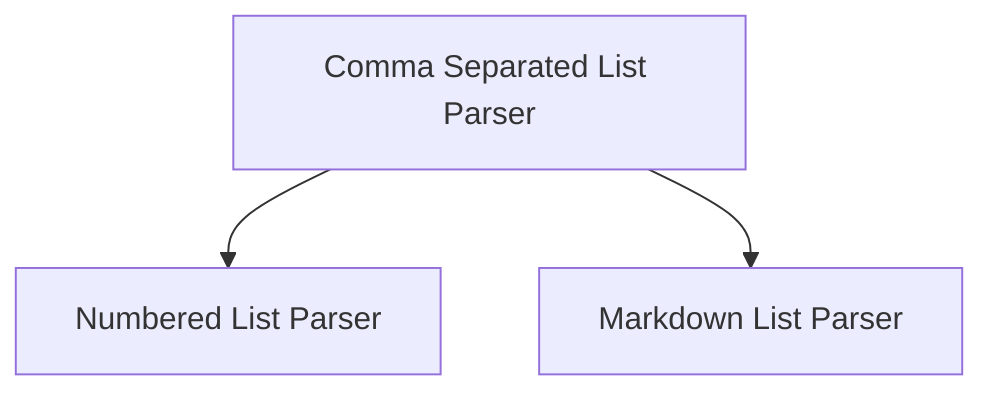

# List Format Parsers Module

## Introduction

The `list_format_parsers` module provides specialized output parsers designed to convert various list formats from language model outputs into structured Python lists. This module is essential for applications requiring robust parsing of common list types, such as comma-separated values, numbered lists, and Markdown lists, ensuring that model responses can be easily consumed and processed programmatically.

## Architecture Overview

The module comprises several distinct list parsers, each inheriting from a base `ListOutputParser`. Each parser is tailored to a specific list format, providing methods to define format instructions for the language model and to parse the resulting text into a list of strings.

<!-- DIAGRAM_JSON
{
    "direction": "TD",
    "nodes": [
        {"id": "comma_separated_list_parser", "label": "Comma Separated List Parser", "type": "module", "link": "comma_separated_list_parser.md"},
        {"id": "numbered_list_parser", "label": "Numbered List Parser", "type": "module", "link": "numbered_list_parser.md"},
        {"id": "markdown_list_parser", "label": "Markdown List Parser", "type": "module", "link": "markdown_list_parser.md"}
    ],
    "edges": [
        {"source": "comma_separated_list_parser", "target": "numbered_list_parser"},
        {"source": "comma_separated_list_parser", "target": "markdown_list_parser"}
    ],
    "groups": []
}
-->

## Sub-modules and Functionality

### [Comma Separated List Parser](comma_separated_list_parser.md)
This sub-module contains the `CommaSeparatedListOutputParser`, which is responsible for parsing model outputs that consist of comma-separated values. It uses CSV reader logic for robust parsing, with a fallback to simple string splitting.

### [Numbered List Parser](numbered_list_parser.md)
This sub-module provides the `NumberedListOutputParser`, designed to extract items from model responses formatted as numbered lists. It utilizes regular expressions to accurately identify and parse each item.

### [Markdown List Parser](markdown_list_parser.md)
This sub-module includes the `MarkdownListOutputParser`, which specializes in parsing Markdown-formatted lists from model outputs. It uses regular expressions to find and extract list items prefixed with hyphens or asterisks.