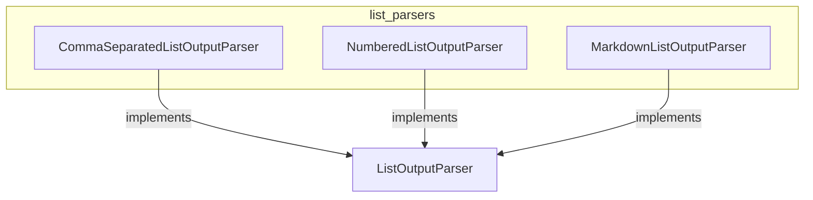

# list_parsers
This module provides various output parsers for converting model output into different list formats, including comma-separated, numbered, and Markdown lists.

<!-- DIAGRAM_JSON
{
    "nodes": [
        {
            "id": "ListOutputParser",
            "label": "ListOutputParser",
            "type": "class"
        },
        {
            "id": "CommaSeparatedListOutputParser",
            "label": "CommaSeparatedListOutputParser",
            "type": "class"
        },
        {
            "id": "NumberedListOutputParser",
            "label": "NumberedListOutputParser",
            "type": "class"
        },
        {
            "id": "MarkdownListOutputParser",
            "label": "MarkdownListOutputParser",
            "type": "class"
        }
    ],
    "edges": [
        {
            "source": "CommaSeparatedListOutputParser",
            "target": "ListOutputParser",
            "type": "inherits"
        },
        {
            "source": "NumberedListOutputParser",
            "target": "ListOutputParser",
            "type": "inherits"
        },
        {
            "source": "MarkdownListOutputParser",
            "target": "ListOutputParser",
            "type": "inherits"
        }
    ],
    "groups": [
        {
            "id": "list_parsers_module",
            "label": "list_parsers",
            "nodes": [
                "CommaSeparatedListOutputParser",
                "NumberedListOutputParser",
                "MarkdownListOutputParser"
            ]
        }
    ]
}
-->
