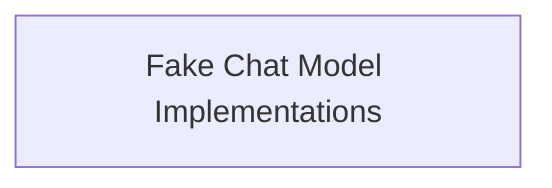

# list_response_models Module Documentation

## Introduction

The `list_response_models` module provides fake chat model implementations primarily used for testing purposes. These models allow developers to simulate chat model behavior by cycling through a predefined list of responses, facilitating consistent and predictable testing scenarios without relying on actual LLM calls.

## Architecture Overview

The `list_response_models` module is a child of the `fake_chat_models` module, which is part of the `core_language_models` within the `langchain_core` library. It specifically focuses on offering simple, list-based fake chat models. The architecture is straightforward, with the core functionality encapsulated within a single sub-module.

<!-- DIAGRAM_JSON
{
    "direction": "TD",
    "nodes": [
        {"id": "fake_chat_models_implementation", "label": "Fake Chat Model Implementations", "type": "module", "link": "fake_chat_models_implementation.md"}
    ],
    "edges": [],
    "groups": []
}
-->

## Sub-modules

### [Fake Chat Model Implementations](fake_chat_models_implementation.md)
This sub-module contains the core implementations of fake chat models, such as `FakeListChatModel` and `FakeMessagesListChatModel`, which are designed to return pre-configured responses in a cyclic manner.