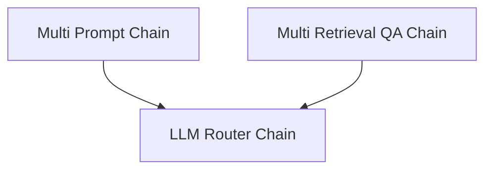

# LLM Based Routers Module

The `llm_based_routers` module provides core functionalities for dynamically routing requests and managing conversational flows using Language Model (LLM) powered decision-making. It enables the creation of adaptive chains that can direct queries to various sub-chains or information sources based on LLM outputs.

## Architecture Overview

The `llm_based_routers` module is built around a set of specialized chains that leverage LLMs for intelligent routing. The `LLMRouterChain` acts as the fundamental component, making routing decisions. Building upon this, the `MultiPromptChain` directs queries to different prompts, while the `MultiRetrievalQAChain` routes queries to various retrieval-augmented generation (RAG) chains. These components work in conjunction to create flexible and responsive conversational agents.

<!-- DIAGRAM_JSON
{
    "direction": "TD",
    "nodes": [
        {"id": "llm_router_chain_module", "label": "LLM Router Chain", "type": "module", "link": "llm_router_chain_module.md"},
        {"id": "multi_prompt_chain_module", "label": "Multi Prompt Chain", "type": "module", "link": "multi_prompt_chain_module.md"},
        {"id": "multi_retrieval_qa_chain_module", "label": "Multi Retrieval QA Chain", "type": "module", "link": "multi_retrieval_qa_chain_module.md"}
    ],
    "edges": [
        {"source": "multi_prompt_chain_module", "target": "llm_router_chain_module"},
        {"source": "multi_retrieval_qa_chain_module", "target": "llm_router_chain_module"}
    ],
    "groups": []
}
-->

## Sub-modules

This module contains the following key sub-modules:

*   ### [LLM Router Chain](llm_router_chain_module.md)
    The `llm_router_chain_module` defines the `LLMRouterChain`, a foundational component for routing decisions based on LLM outputs. It uses an internal LLM chain to determine the destination and process inputs, facilitating dynamic control flow within larger systems.

*   ### [Multi Prompt Chain](multi_prompt_chain_module.md)
    The `multi_prompt_chain_module` introduces the `MultiPromptChain`, which extends the `LLMRouterChain` to dynamically select and execute different prompts. This allows for flexible conversational agents that can adapt their responses based on the input query by routing to specialized prompts.

*   ### [Multi Retrieval QA Chain](multi_retrieval_qa_chain_module.md)
    The `multi_retrieval_qa_chain_module` implements the `MultiRetrievalQAChain`, designed to route queries to various retrieval-augmented generation (RAG) chains. It leverages an `LLMRouterChain` to intelligently choose the most appropriate retriever and prompt for answering complex questions, enhancing the system's ability to fetch and synthesize information from diverse sources.