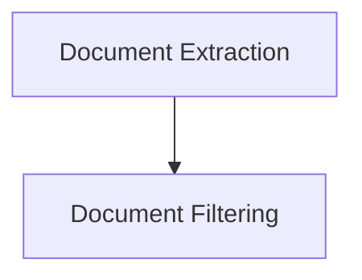

# LLM Chain Compressors Module

## Introduction

The `llm_chain_compressors` module provides tools for compressing and filtering documents using Language Model (LLM) chains. It is a crucial part of the document retrieval system within the classic LangChain framework, enabling more efficient processing of information by focusing on relevant content.

## Architecture Overview

This module is comprised of two primary sub-modules: `document_extraction` and `document_filtering`. The `document_extraction` sub-module is responsible for distilling the most pertinent information from documents, while the `document_filtering` sub-module determines the relevance of documents to a given query, discarding irrelevant ones. Both sub-modules leverage LLM chains to perform their respective compression tasks.

<!-- DIAGRAM_JSON
{
    "direction": "TD",
    "nodes": [
        {"id": "document_extraction", "label": "Document Extraction", "type": "module", "link": "document_extraction.md"},
        {"id": "document_filtering", "label": "Document Filtering", "type": "module", "link": "document_filtering.md"}
    ],
    "edges": [
        {"source": "document_extraction", "target": "document_filtering"}
    ],
    "groups": []
}
-->

## Sub-modules

### [Document Extraction](document_extraction.md)

This sub-module contains the `LLMChainExtractor` component, which uses an LLM chain to extract the most relevant portions of documents based on a given query. It is designed to reduce the size of documents while retaining their core information.

### [Document Filtering](document_filtering.md)

The `document_filtering` sub-module includes the `LLMChainFilter` component. This component utilizes an LLM chain to assess the relevance of documents to a query, effectively filtering out documents that are not pertinent. It typically expects a boolean output from the LLM chain to decide whether to include or exclude a document.