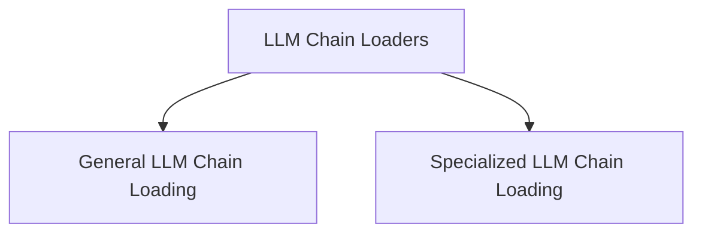

# llm_chain_loaders Module Documentation

## Introduction

The `llm_chain_loaders` module is responsible for loading various types of Language Model (LLM) chains from predefined configurations or file paths. It provides utilities to instantiate generic LLM chains as well as specialized chains like checker chains and mathematical expression chains.

## Architecture Overview

The module is structured into two main sub-modules, catering to general-purpose LLM chain loading and more specialized chain loading requirements.

<!-- DIAGRAM_JSON
{
    "direction": "TD",
    "nodes": [
        {"id": "general_llm_chain_loading", "label": "General LLM Chain Loading", "type": "module", "link": "general_llm_chain_loading.md"},
        {"id": "specialized_llm_chain_loading", "label": "Specialized LLM Chain Loading", "type": "module", "link": "specialized_llm_chain_loading.md"}
    ],
    "edges": [
        {"source": "llm_chain_loaders", "target": "general_llm_chain_loading"},
        {"source": "llm_chain_loaders", "target": "specialized_llm_chain_loading"}
    ],
    "groups": []
}
-->

## Sub-modules

- ### [General LLM Chain Loading](general_llm_chain_loading.md)
  This sub-module focuses on loading and configuring fundamental LLM chains. It provides the core functionality to instantiate generic `LLMChain` objects from configuration dictionaries or specified file paths, ensuring flexibility in how basic LLM interactions are set up.

- ### [Specialized LLM Chain Loading](specialized_llm_chain_loading.md)
  This sub-module is dedicated to loading more specific types of LLM chains, such as `LLMCheckerChain` and `LLMMathChain`. It encapsulates the logic required to parse configurations for these specialized chains, including their respective LLM and prompt dependencies, enabling complex AI functionalities like assertion checking and mathematical problem-solving.
