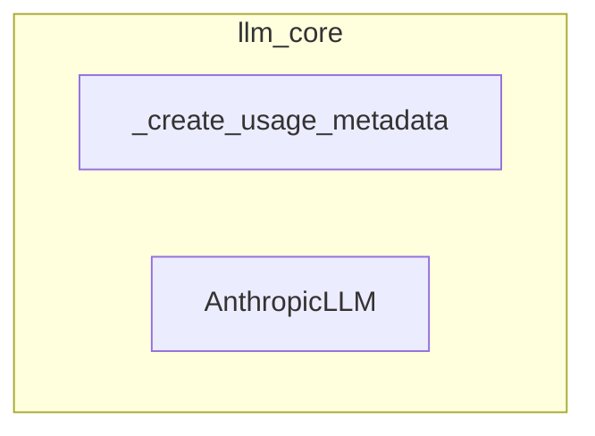

# llm_core
This module provides components for integrating with Anthropic language models, including a utility for processing usage metadata and a deprecated legacy LLM class.

<!-- DIAGRAM_JSON
{
    "nodes": [
        {
            "id": "A",
            "label": "_create_usage_metadata",
            "type": "function"
        },
        {
            "id": "B",
            "label": "AnthropicLLM",
            "type": "class"
        }
    ],
    "edges": [],
    "groups": [
        {
            "id": "llm_core",
            "label": "llm_core",
            "nodes": [
                "A",
                "B"
            ]
        }
    ]
}
-->
