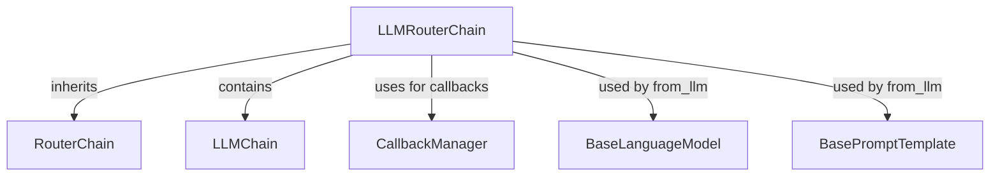

# llm_router_chain_module

This module provides the `LLMRouterChain` class, a specialized chain designed for routing user queries to different downstream chains based on an LLM's decision. It leverages an internal LLM to parse input and determine the appropriate "destination" and "next_inputs" for subsequent processing. **Note that this class is deprecated in favor of more modern and flexible routing mechanisms within LangChain, which offer benefits like streaming and batch support.**

## Module Overview

The `LLMRouterChain` acts as an intelligent dispatcher. It takes a user query, passes it to an internal `LLMChain` for analysis, and then uses the LLM's output to decide which subsequent chain should handle the query. The LLM's output must be structured to include a `destination` and `next_inputs` for proper routing.

### Core Functionality

*   **LLM-based Routing**: Utilizes an `LLMChain` to make routing decisions.
*   **Input/Output Validation**: Ensures the internal `LLMChain`'s prompt has an output parser that generates a dictionary with `destination` and `next_inputs`.
*   **Asynchronous Support**: Provides both synchronous (`_call`) and asynchronous (`_acall`) methods for routing.
*   **Convenience Constructor**: `from_llm` static method simplifies the creation of an `LLMRouterChain` instance.

## Architecture and Component Relationships

The `llm_router_chain_module` primarily revolves around the `LLMRouterChain` class and its interaction with other core LangChain components.

<!-- DIAGRAM_JSON
{
    "direction": "TD",
    "nodes": [
        {"id": "llm_router_chain", "label": "LLMRouterChain", "type": "component", "link": null},
        {"id": "router_chain", "label": "RouterChain", "type": "external", "link": "classic_chains_router.md"},
        {"id": "llm_chain", "label": "LLMChain", "type": "external", "link": "classic_chains_base.md"},
        {"id": "base_language_model", "label": "BaseLanguageModel", "type": "external", "link": "core_language_models.md"},
        {"id": "base_prompt_template", "label": "BasePromptTemplate", "type": "external", "link": "core_prompts.md"},
        {"id": "callback_manager", "label": "CallbackManager", "type": "external", "link": "core_callbacks.md"}
    ],
    "edges": [
        {"source": "llm_router_chain", "target": "router_chain", "label": "inherits"},
        {"source": "llm_router_chain", "target": "llm_chain", "label": "contains"},
        {"source": "llm_router_chain", "target": "callback_manager", "label": "uses for callbacks"},
        {"source": "llm_router_chain", "target": "base_language_model", "label": "used by from_llm"},
        {"source": "llm_router_chain", "target": "base_prompt_template", "label": "used by from_llm"}
    ],
    "groups": []
}
-->

### Relationships:

*   **`LLMRouterChain`** inherits from [`RouterChain`](classic_chains_router.md), establishing its role as a routing mechanism.
*   It *contains* an instance of [`LLMChain`](classic_chains_base.md), which is the core component responsible for interacting with the Language Model to determine routing.
*   It leverages [`CallbackManagerForChainRun`](core_callbacks.md) (and its asynchronous counterpart) for managing callbacks during execution.
*   The `from_llm` constructor method takes a [`BaseLanguageModel`](core_language_models.md) and a [`BasePromptTemplate`](core_prompts.md) to initialize the internal `LLMChain`.

## Integration with the Overall System

The `llm_router_chain_module` is part of the `classic_chains_router` package, indicating its place within the traditional chain architecture of LangChain. It provides a way to introduce dynamic, LLM-driven routing logic into larger applications. While deprecated, its concepts are foundational to understanding how intelligent routing can be implemented in conversational AI and agent systems.

For modern routing implementations, refer to the example provided in the `LLMRouterChain` docstring, which utilizes `RunnableLambda` and structured output models for a more flexible and performant approach.