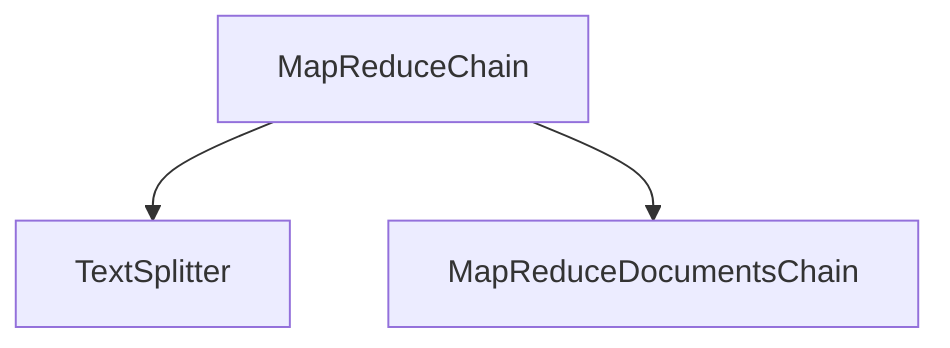

# map_reduce_chain_module

## Introduction
The `map_reduce_chain_module` provides the `MapReduceChain` class, a specialized chain designed for processing large volumes of text by splitting them into smaller chunks, applying a language model to each chunk (map step), and then combining the results into a final coherent output (reduce step). This module is crucial for handling documents or data that exceed the context window of a single language model call.

## Module Architecture

<!-- DIAGRAM_JSON
{
    "direction": "TD",
    "nodes": [
        {"id": "map_reduce_chain", "label": "MapReduceChain", "type": "component", "link": null},
        {"id": "text_splitter", "label": "TextSplitter", "type": "external", "link": "text_splitters_base.md"},
        {"id": "map_reduce_documents_chain", "label": "MapReduceDocumentsChain", "type": "external", "link": "classic_chains_summarize.md"}
    ],
    "edges": [
        {"source": "map_reduce_chain", "target": "text_splitter"},
        {"source": "map_reduce_chain", "target": "map_reduce_documents_chain"}
    ],
    "groups": []
}
-->

## Core Functionality

The `MapReduceChain` is implemented by the `MapReduceChain` class. Its primary function is to enable processing of large texts through a two-step "map-reduce" paradigm:

1.  **Map Step**: The input text is first divided into smaller, manageable chunks using a configurable `TextSplitter`. Each chunk is then processed independently, typically by an `LLMChain` (configured within the `MapReduceDocumentsChain`), to generate an intermediate output.
2.  **Reduce Step**: The intermediate outputs from the map step are then combined and aggregated into a final, consolidated result. This is handled by a `ReduceDocumentsChain` and `StuffDocumentsChain`, which are orchestrated by the `MapReduceDocumentsChain`.

### `MapReduceChain` Class

The `MapReduceChain` class is the central component of this module. It encapsulates the logic for splitting the input text and coordinating with a `BaseCombineDocumentsChain` (specifically a `MapReduceDocumentsChain` in the `from_params` constructor) to execute the map and reduce operations.

**Key Attributes:**

*   `combine_documents_chain`: An instance of `BaseCombineDocumentsChain` (typically `MapReduceDocumentsChain`), responsible for the actual map-reduce logic on documents.
*   `text_splitter`: An instance of `TextSplitter` (see [text_splitters_base.md](text_splitters_base.md)) used to break down large input texts into smaller `Document` objects.
*   `input_key`: The key under which the input text is expected in the chain's input dictionary (default: "input_text").
*   `output_key`: The key under which the final processed output will be returned (default: "output_text").

**`from_params` Constructor:**

This class method provides a convenient way to construct a `MapReduceChain` with common configurations. It internally sets up the necessary sub-chains:

*   An `LLMChain` is created, which will be used for both the "map" prompt on individual document chunks and potentially within the "reduce" step. This chain requires a [BaseLanguageModel](core_language_models.md) (LLM) and a [BasePromptTemplate](core_prompts.md).
*   A `StuffDocumentsChain` is configured to handle the reduction of documents, wrapping the `LLMChain`.
*   A `ReduceDocumentsChain` orchestrates the `StuffDocumentsChain` to combine multiple reduced documents.
*   Finally, a `MapReduceDocumentsChain` is assembled, utilizing the `LLMChain` for the mapping of individual documents and the `ReduceDocumentsChain` for combining their outputs. This `MapReduceDocumentsChain` is then assigned to the `combine_documents_chain` attribute of the `MapReduceChain`.

## Integration with the Overall System

The `map_reduce_chain_module` is situated within the `classic_chains_specialized` category, specifically under `data_processing_chains.text_processing_chains`. This placement indicates its role in advanced text manipulation and summarization tasks within the classic LangChain architecture.

It depends on:

*   **Text Splitting:** Relies on the `TextSplitter` interface (from [text_splitters_base.md](text_splitters_base.md)) to prepare input for processing.
*   **Language Models:** Leverages [BaseLanguageModel](core_language_models.md) for its core AI capabilities through `LLMChain`.
*   **Prompting:** Utilizes [BasePromptTemplate](core_prompts.md) to define how language models interact with the split text chunks.
*   **Document Combination Chains:** Integrates tightly with various document combination chains, particularly `MapReduceDocumentsChain`, `ReduceDocumentsChain`, and `StuffDocumentsChain` (typically found in modules like [classic_chains_summarize.md](classic_chains_summarize.md)), which handle the actual document processing and aggregation logic.
*   **Base Chains:** Inherits from `Chain` and uses `LLMChain` (defined in [classic_chains_base.md](classic_chains_base.md)) for basic LLM interactions.

This module provides a powerful abstraction for tasks such as summarizing long documents, performing Q&A over extensive texts, or processing large datasets where direct LLM calls are not feasible due to context window limitations.