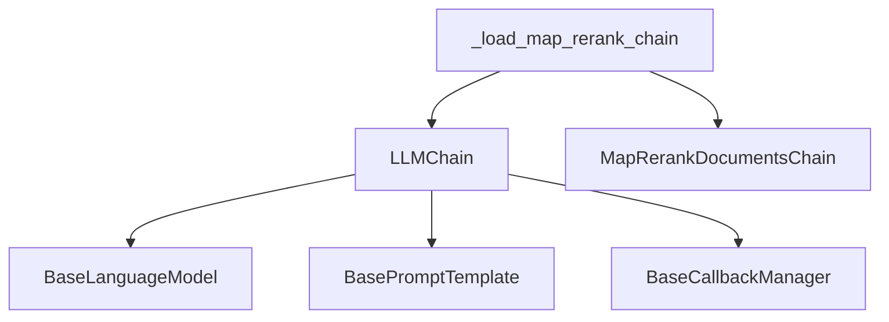
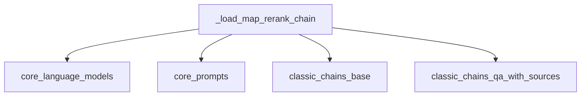

# Map Rerank Chain Loader Module

The `map_rerank_chain_loader` module provides a utility function for constructing a `MapRerankDocumentsChain`. This chain is designed for question-answering tasks where multiple documents are initially processed (mapped), and then their responses are re-ranked to select the best answer.

## Architecture and Component Relationships

This module's primary function, `_load_map_rerank_chain`, orchestrates the creation of a `MapRerankDocumentsChain` by configuring an internal `LLMChain` with the provided language model and prompt. It integrates various core components for language model interaction, prompt management, and callback handling.

<!-- DIAGRAM_JSON
{
    "direction": "TD",
    "nodes": [
        {"id": "load_map_rerank_chain", "label": "_load_map_rerank_chain", "type": "component", "link": null},
        {"id": "llm_chain", "label": "LLMChain", "type": "component", "link": null},
        {"id": "map_rerank_documents_chain", "label": "MapRerankDocumentsChain", "type": "component", "link": null},
        {"id": "base_language_model", "label": "BaseLanguageModel", "type": "external", "link": "core_language_models.md"},
        {"id": "base_prompt_template", "label": "BasePromptTemplate", "type": "external", "link": "core_prompts.md"},
        {"id": "base_callback_manager", "label": "BaseCallbackManager", "type": "external", "link": "core_callbacks.md"}
    ],
    "edges": [
        {"source": "load_map_rerank_chain", "target": "llm_chain"},
        {"source": "load_map_rerank_chain", "target": "map_rerank_documents_chain"},
        {"source": "llm_chain", "target": "base_language_model"},
        {"source": "llm_chain", "target": "base_prompt_template"},
        {"source": "llm_chain", "target": "base_callback_manager"}
    ],
    "groups": []
}
-->



## Core Components

### `_load_map_rerank_chain`

```python
def _load_map_rerank_chain(
    llm: BaseLanguageModel,
    *,
    prompt: BasePromptTemplate = MAP_RERANK_PROMPT,
    verbose: bool = False,
    document_variable_name: str = "context",
    rank_key: str = "score",
    answer_key: str = "answer",
    callback_manager: BaseCallbackManager | None = None,
    callbacks: Callbacks = None,
    **kwargs: Any,
) -> MapRerankDocumentsChain:
    llm_chain = LLMChain(
        llm=llm,
        prompt=prompt,
        verbose=verbose,
        callback_manager=callback_manager,
        callbacks=callbacks,
    )
    return MapRerankDocumentsChain(
        llm_chain=llm_chain,
        rank_key=rank_key,
        answer_key=answer_key,
        document_variable_name=document_variable_name,
        verbose=verbose,
        callback_manager=callback_manager,
        **kwargs,
    )
```

This function is responsible for instantiating and configuring a `MapRerankDocumentsChain`. It takes the following parameters:

*   `llm` ([BaseLanguageModel](core_language_models.md)): The language model to use for the underlying `LLMChain`.
*   `prompt` ([BasePromptTemplate](core_prompts.md)): The prompt template to guide the LLM.
*   `verbose` (bool): Whether to enable verbose logging.
*   `document_variable_name` (str): The name of the variable that will contain the document context.
*   `rank_key` (str): The key in the LLM's output that represents the ranking score.
*   `answer_key` (str): The key in the LLM's output that represents the final answer.
*   `callback_manager` ([BaseCallbackManager](core_callbacks.md) | None): Optional callback manager for handling events.
*   `callbacks` (Callbacks | None): Optional list of callbacks.
*   `**kwargs`: Additional keyword arguments passed to the `MapRerankDocumentsChain`.

Internally, it first creates an `LLMChain` with the provided `llm`, `prompt`, `verbose`, and callback parameters. This `LLMChain` performs the initial "map" step. Then, it constructs and returns a `MapRerankDocumentsChain`, passing the created `LLMChain` and other configuration parameters to it. The `MapRerankDocumentsChain` handles the re-ranking logic based on the `rank_key` and extracts the final answer using the `answer_key`.

## How it Fits into the Overall System

The `map_rerank_chain_loader` module is a specialized component within the `classic_chains_question_answering` family of modules. It provides a concrete implementation for a specific strategy of question answering, where multiple documents are processed and then a ranking mechanism is applied to select the most relevant or best answer. This module enables the system to leverage language models for complex QA scenarios requiring document synthesis and prioritization, integrating seamlessly with core LLM, prompt, and callback functionalities provided by other modules like `core_language_models`, `core_prompts`, and `core_callbacks` respectively. It is crucial for applications that need to process a large corpus of documents and extract precise answers based on relevance scoring.

## Introduction

The `map_rerank_chain_loader` module is a vital component within the `classic_chains_qa_with_sources.loading` package, specifically designed for constructing and loading "Map Rerank" style Question Answering (QA) chains. These chains are particularly useful in scenarios where multiple documents are initially retrieved and then reranked based on their relevance to a given query, ultimately producing a concise answer and source citations.

## Purpose and Core Functionality

The primary purpose of this module is to provide a standardized method for initializing a `MapRerankDocumentsChain`. This chain leverages a Language Model (LLM) to first process each document independently (the "map" step) and then rerank them based on a relevance score, before synthesizing a final answer from the most relevant sources. This approach is highly effective for improving the accuracy and relevance of answers from a large corpus of documents.

### Core Component: `_load_map_rerank_chain`

The `_load_map_rerank_chain` function is the main entry point for creating an instance of `MapRerankDocumentsChain`. It orchestrates the setup of an internal `LLMChain` with a specified prompt and then integrates it into the `MapRerankDocumentsChain` along with other configuration parameters.

**Parameters:**

*   `llm` (`BaseLanguageModel`): The language model to be used for processing documents and generating answers.
*   `prompt` (`BasePromptTemplate`, optional): The prompt template used by the internal `LLMChain`. Defaults to `MAP_RERANK_PROMPT`.
*   `verbose` (`bool`, optional): If set to `True`, the chain's operations will be more verbose, aiding in debugging. Defaults to `False`.
*   `document_variable_name` (`str`, optional): The variable name under which documents are passed to the `LLMChain`. Defaults to `"context"`.
*   `rank_key` (`str`, optional): The key in the LLM's output that contains the rerank score. Defaults to `"score"`.
*   `answer_key` (`str`, optional): The key in the LLM's output that contains the final answer. Defaults to `"answer"`.
*   `**kwargs` (`Any`): Additional keyword arguments to be passed directly to the `MapRerankDocumentsChain` constructor.

**Returns:**

*   `MapRerankDocumentsChain`: An initialized instance of the Map Rerank Documents Chain.

## Architecture and Component Relationships

The `map_rerank_chain_loader` module acts as a factory for `MapRerankDocumentsChain` instances. It primarily depends on core LangChain components for its functionality:

<!-- DIAGRAM_JSON
{
    "direction": "TD",
    "nodes": [
        {"id": "_load_map_rerank_chain", "label": "_load_map_rerank_chain", "type": "component", "link": null},
        {"id": "core_language_models", "label": "core_language_models", "type": "external", "link": "core_language_models.md"},
        {"id": "core_prompts", "label": "core_prompts", "type": "external", "link": "core_prompts.md"},
        {"id": "classic_chains_base", "label": "classic_chains_base", "type": "external", "link": "classic_chains_base.md"},
        {"id": "classic_chains_qa_with_sources", "label": "classic_chains_qa_with_sources", "type": "external", "link": "classic_chains_qa_with_sources.md"}
    ],
    "edges": [
        {"source": "_load_map_rerank_chain", "target": "core_language_models"},
        {"source": "_load_map_rerank_chain", "target": "core_prompts"},
        {"source": "_load_map_rerank_chain", "target": "classic_chains_base"},
        {"source": "_load_map_rerank_chain", "target": "classic_chains_qa_with_sources"}
    ],
    "groups": []
}
-->


### Dependencies Explained:

*   **`core_language_models`**: Provides the `BaseLanguageModel` interface, which is essential for the `llm` parameter to `_load_map_rerank_chain` and the subsequent `LLMChain` creation.
*   **`core_prompts`**: Supplies the `BasePromptTemplate` type, used for defining the prompt that guides the LLM in processing documents and generating outputs.
*   **`classic_chains_base`**: This module is expected to contain the `LLMChain` class, a foundational component used within `_load_map_rerank_chain` to encapsulate the language model and prompt logic.
*   **`classic_chains_qa_with_sources`**: This module is the home of the `MapRerankDocumentsChain` class, which is the ultimate output of the `_load_map_rerank_chain` function.

## How the Module Fits into the Overall System

The `map_rerank_chain_loader` module is a specialized loader within the broader `classic_chains_qa_with_sources` family. It enables developers to easily instantiate a specific type of QA chain without needing to manually set up all its internal components. This promotes modularity and reusability across the LangChain ecosystem.

It integrates with the system by taking fundamental components like language models and prompts and assembling them into a complex, task-specific chain. This chain can then be used in applications requiring robust question answering capabilities with source attribution, where document relevance plays a critical role in the final output. It is analogous to other loaders such as [refine_chain_loader](refine_chain_loader.md), [map_reduce_chain_loader](map_reduce_chain_loader.md), and [stuff_chain_loader](stuff_chain_loader.md), each providing a distinct strategy for QA with sources.`