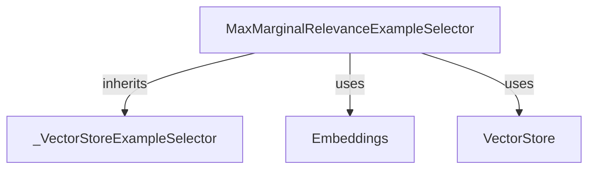

# `max_marginal_relevance_selector` Module Documentation

## Introduction

The `max_marginal_relevance_selector` module provides a powerful mechanism for selecting relevant and diverse examples based on the Max Marginal Relevance (MMR) algorithm. This method is particularly useful in few-shot learning scenarios where selecting a high-quality set of examples can significantly impact model performance. By balancing relevance to the input query with diversity among the selected examples, MMR helps to prevent redundancy and provide a more comprehensive context.

## Purpose and Core Functionality

The primary purpose of this module is to implement the `MaxMarginalRelevanceExampleSelector` class, which is designed to improve example selection by leveraging vector stores and embeddings. It dynamically reshuffles examples to ensure that the chosen examples are not only relevant but also distinct from each other.

### `MaxMarginalRelevanceExampleSelector`

This class is the core component of the module. It inherits from `_VectorStoreExampleSelector` (see [core_example_selectors.md](core_example_selectors.md)) and utilizes a vector store to perform efficient similarity searches and apply the MMR algorithm.

**Key Features:**

*   **Max Marginal Relevance (MMR) Algorithm:** Selects examples that are similar to the input query while also being diverse among themselves, based on the approach described in the paper: [https://arxiv.org/pdf/2211.13892.pdf](https://arxiv.org/pdf/2211.13892.pdf).
*   **Configurable `fetch_k`:** Allows specifying the number of initial examples to fetch from the vector store before reranking them using MMR. This parameter (`fetch_k`) is distinct from the final number of examples to return (`k`).
*   **Synchronous and Asynchronous Operations:** Provides both `select_examples` and `aselect_examples` methods for flexible integration into various application architectures.
*   **Initialization from Examples:** The `from_examples` and `afrom_examples` class methods facilitate easy instantiation of the selector using a list of raw examples, an embedding model, and a vector store class.

**Methods:**

*   `select_examples(input_variables: dict[str, str]) -> list[dict]`: Synchronously selects examples using the MMR algorithm based on the provided input variables.
*   `aselect_examples(input_variables: dict[str, str]) -> list[dict]`: Asynchronously selects examples using the MMR algorithm.
*   `from_examples(...) -> MaxMarginalRelevanceExampleSelector`: A class method to create an instance of the selector from a list of examples, an embedding model (see [classic_embeddings.md](classic_embeddings.md)), and a vector store class (see [core_vectorstores.md](core_vectorstores.md)). It handles the creation of the underlying vector store.
*   `afrom_examples(...) -> MaxMarginalRelevanceExampleSelector`: The asynchronous equivalent of `from_examples`.

## Architecture and Component Relationships

The `MaxMarginalRelevanceExampleSelector` class is built upon the `_VectorStoreExampleSelector` base class, suggesting a common interface for example selectors that leverage vector stores. Its core functionality heavily relies on an injected `VectorStore` instance for efficient retrieval and an `Embeddings` object for converting examples into vector representations.

It interacts with:

*   **`_VectorStoreExampleSelector`**: The abstract base class that provides common functionality for example selectors backed by a vector store. This module implements the MMR-specific selection logic on top of this base. (See [core_example_selectors.md](core_example_selectors.md))
*   **`Embeddings`**: An interface for generating vector embeddings of text. This is crucial for calculating similarities between the input query and examples. (See [classic_embeddings.md](classic_embeddings.md))
*   **`VectorStore`**: An interface for storing and retrieving vector representations of data. The `max_marginal_relevance_selector` uses methods like `max_marginal_relevance_search` from this interface. (See [core_vectorstores.md](core_vectorstores.md))

## How the Module Fits into the Overall System

The `max_marginal_relevance_selector` module is a specialized component within the `core_example_selectors` package. It provides an advanced strategy for example selection that aims to optimize the quality of examples provided to language models. By intelligently selecting diverse yet relevant examples, it contributes to improving the performance and reliability of systems that rely on few-shot prompting, such as various `core_agents` and `core_language_models` applications.

It serves as a key utility for developers looking to implement sophisticated example selection logic without having to manage the underlying vector store and embedding interactions directly.

<!-- DIAGRAM_JSON
{
    "direction": "TD",
    "nodes": [
        {"id": "mmr_selector", "label": "MaxMarginalRelevanceExampleSelector", "type": "component", "link": null},
        {"id": "vector_store_example_selector_base", "label": "_VectorStoreExampleSelector", "type": "external", "link": "core_example_selectors.md"},
        {"id": "embeddings_interface", "label": "Embeddings", "type": "external", "link": "classic_embeddings.md"},
        {"id": "vector_store_interface", "label": "VectorStore", "type": "external", "link": "core_vectorstores.md"}
    ],
    "edges": [
        {"source": "mmr_selector", "target": "vector_store_example_selector_base", "label": "inherits"},
        {"source": "mmr_selector", "target": "embeddings_interface", "label": "uses"},
        {"source": "mmr_selector", "target": "vector_store_interface", "label": "uses"}
    ],
    "groups": []
}
-->
