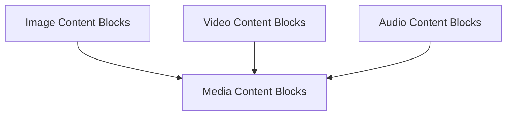

# Media Content Blocks Module Documentation

## Introduction

The `media_content_blocks` module is responsible for facilitating the creation of various media content blocks—specifically images, videos, and audio—within LangChain messages. These content blocks allow for the rich representation of multimedia information in conversational AI applications, enhancing the interactive capabilities of language models.

## Architecture Overview

The `media_content_blocks` module is part of the larger `content_blocks` module, which in turn belongs to the `core_messages` module. It provides dedicated functions for constructing different types of media content, ensuring proper formatting and validation. This module directly contributes to the core functionality of representing diverse data types within AI-driven conversations.

<!-- DIAGRAM_JSON
{
    "direction": "TD",
    "nodes": [
        {"id": "image_blocks", "label": "Image Content Blocks", "type": "module", "link": "image_blocks.md"},
        {"id": "video_blocks", "label": "Video Content Blocks", "type": "module", "link": "video_blocks.md"},
        {"id": "audio_blocks", "label": "Audio Content Blocks", "type": "module", "link": "audio_blocks.md"}
    ],
    "edges": [
        {"source": "image_blocks", "target": "media_content_blocks"},
        {"source": "video_blocks", "target": "media_content_blocks"},
        {"source": "audio_blocks", "target": "media_content_blocks"}
    ],
    "groups": []
}
-->

## Sub-modules

This module is comprised of the following sub-modules, each dedicated to a specific type of media content block:

- [Audio Content Blocks](audio_blocks.md): Handles the creation and management of audio content blocks.
- [Image Content Blocks](image_blocks.md): Manages the creation and handling of image content blocks.
- [Video Content Blocks](video_blocks.md): Provides functionality for creating and managing video content blocks.
