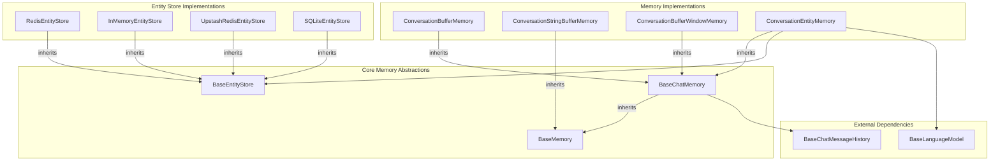

# memory
The `memory` module provides various implementations for managing conversational state, including buffer, window, and entity-based memories, along with different backend stores for entities.

<!-- DIAGRAM_JSON
{
    "nodes": [
        {
            "id": "memory",
            "label": "memory",
            "type": "module"
        },
        {
            "id": "BM",
            "label": "BaseMemory",
            "type": "abstract"
        },
        {
            "id": "BCM",
            "label": "BaseChatMemory",
            "type": "abstract"
        },
        {
            "id": "BES",
            "label": "BaseEntityStore",
            "type": "abstract"
        },
        {
            "id": "CBM",
            "label": "ConversationBufferMemory"
        },
        {
            "id": "CSBM",
            "label": "ConversationStringBufferMemory"
        },
        {
            "id": "CBWM",
            "label": "ConversationBufferWindowMemory"
        },
        {
            "id": "CEM",
            "label": "ConversationEntityMemory"
        },
        {
            "id": "RES",
            "label": "RedisEntityStore"
        },
        {
            "id": "IMES",
            "label": "InMemoryEntityStore"
        },
        {
            "id": "URES",
            "label": "UpstashRedisEntityStore"
        },
        {
            "id": "SLES",
            "label": "SQLiteEntityStore"
        },
        {
            "id": "BCMH",
            "label": "BaseChatMessageHistory",
            "type": "inferred"
        },
        {
            "id": "BLM",
            "label": "BaseLanguageModel",
            "type": "inferred"
        },
        {
            "id": "entity_memories_and_stores",
            "label": "Entity Memories and Stores",
            "type": "module",
            "link": "entity_memories_and_stores.md"
        },
        {
            "id": "summary_memories",
            "label": "Summary Memories",
            "type": "module",
            "link": "summary_memories.md"
        },
        {
            "id": "buffer_memories",
            "label": "Buffer Memories",
            "type": "module",
            "link": "buffer_memories.md"
        },
        {
            "id": "vector_store_memory",
            "label": "Vector Store Memory",
            "type": "module",
            "link": "vector_store_memory.md"
        },
        {
            "id": "memory_interfaces",
            "label": "Memory Interfaces",
            "type": "module",
            "link": "memory_interfaces.md"
        }
    ],
    "edges": [
        {
            "source": "BCM",
            "target": "BM",
            "type": "inheritance"
        },
        {
            "source": "CBM",
            "target": "BCM",
            "type": "inheritance"
        },
        {
            "source": "CSBM",
            "target": "BM",
            "type": "inheritance"
        },
        {
            "source": "CBWM",
            "target": "BCM",
            "type": "inheritance"
        },
        {
            "source": "CEM",
            "target": "BCM",
            "type": "inheritance"
        },
        {
            "source": "RES",
            "target": "BES",
            "type": "inheritance"
        },
        {
            "source": "IMES",
            "target": "BES",
            "type": "inheritance"
        },
        {
            "source": "URES",
            "target": "BES",
            "type": "inheritance"
        },
        {
            "source": "SLES",
            "target": "BES",
            "type": "inheritance"
        },
        {
            "source": "BCM",
            "target": "BCMH",
            "type": "composition",
            "label": "chat_memory"
        },
        {
            "source": "CEM",
            "target": "BES",
            "type": "composition",
            "label": "entity_store"
        },
        {
            "source": "CEM",
            "target": "BLM",
            "type": "composition",
            "label": "llm"
        },
        {
            "source": "memory",
            "target": "entity_memories_and_stores"
        },
        {
            "source": "memory",
            "target": "summary_memories"
        },
        {
            "source": "memory",
            "target": "buffer_memories"
        },
        {
            "source": "memory",
            "target": "vector_store_memory"
        },
        {
            "source": "memory",
            "target": "memory_interfaces"
        }
    ],
    "groups": [
        {
            "id": "Core Memory Abstractions",
            "nodes": [
                "BM",
                "BCM",
                "BES"
            ]
        },
        {
            "id": "Memory Implementations",
            "nodes": [
                "CBM",
                "CSBM",
                "CBWM",
                "CEM"
            ]
        },
        {
            "id": "Entity Store Implementations",
            "nodes": [
                "RES",
                "IMES",
                "URES",
                "SLES"
            ]
        },
        {
            "id": "External Dependencies",
            "nodes": [
                "BCMH",
                "BLM"
            ]
        }
    ]
}
-->
```
