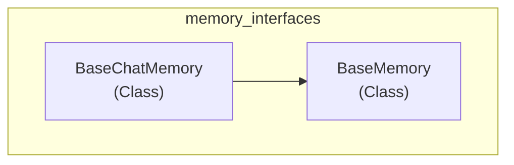

# memory_interfaces
This module defines core interfaces for memory management in chains, providing an abstract base class for general memory and a specialized abstract class for chat-specific memory, `BaseChatMemory` which inherits from `BaseMemory`.

<!-- DIAGRAM_JSON
{
  "nodes": [
    {"id": "BaseMemory", "label": "BaseMemory", "metadata": {"type": "class"}},
    {"id": "BaseChatMemory", "label": "BaseChatMemory", "metadata": {"type": "class"}}
  ],
  "edges": [
    {"source": "BaseChatMemory", "target": "BaseMemory", "label": "inherits"}
  ],
  "groups": [
    {"id": "memory_interfaces", "label": "memory_interfaces", "nodes": ["BaseMemory", "BaseChatMemory"]}
  ]
}
-->
