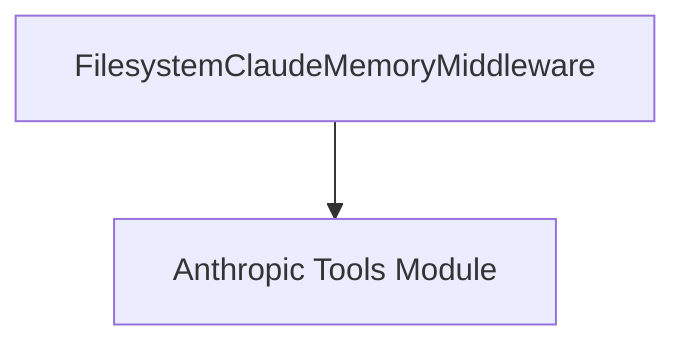

# memory_tools Module Documentation

## Introduction

The `memory_tools` module provides a filesystem-based memory tool specifically designed for Anthropic agents. It encapsulates the `FilesystemClaudeMemoryMiddleware`, which allows agents to store and retrieve information using the local filesystem, enforcing a structured `/memories` prefix for all memory operations.

## Purpose and Core Functionality

The primary purpose of this module is to enable Anthropic agents to leverage a persistent memory store. By using the local filesystem, agents can maintain state across interactions, allowing for more complex and context-aware operations. The module ensures data isolation and organization by enforcing a mandatory `/memories` prefix for all file operations, preventing agents from accessing arbitrary locations on the filesystem. It also injects a recommended system prompt to guide the agent's interaction with the memory.

### `FilesystemClaudeMemoryMiddleware`

This is the core component of the `memory_tools` module. It is a middleware class that provides Anthropic's memory tool functionality by interacting with the local filesystem.

*   **Purpose**: Manages file-based memory for Anthropic agents, ensuring operations are confined to a designated `root_path` and `allowed_prefixes`.
*   **Inheritance**: It extends `_FilesystemClaudeFileToolMiddleware`, inheriting base functionalities for filesystem tool management, which is defined in the [anthropic_tools module](anthropic_tools.md).

#### Initialization Parameters:

*   `root_path` (`str`): The absolute path to the root directory where all file operations for memory will be performed. This path acts as a sandbox for the agent's memory.
*   `allowed_prefixes` (`list[str] | None`): An optional list of virtual path prefixes that the agent is allowed to access within the `root_path`. By default, this is set to `['/memories']`, ensuring all memory interactions occur within this specific logical directory.
*   `max_file_size_mb` (`int`): The maximum allowed size for individual memory files, specified in megabytes. Defaults to `10` MB.
*   `system_prompt` (`str`): The system-level prompt that is injected into the agent's context to guide its usage of the memory tools. Defaults to Anthropic's recommended memory prompt, which encourages effective memory management.

#### Example Usage:

```python
from langchain.agents import create_agent
from langchain.agents.middleware import FilesystemClaudeMemoryMiddleware

# Assuming 'model' and 'tools' are defined elsewhere
agent = create_agent(
    model=model,
    tools=[],
    middleware=[FilesystemClaudeMemoryMiddleware(root_path="/workspace")]
)
```

## Architecture and Component Relationships

The `memory_tools` module primarily consists of the `FilesystemClaudeMemoryMiddleware` class. It relies on the `anthropic_tools` module for its base class (`_FilesystemClaudeFileToolMiddleware`) and related constants (e.g., `MEMORY_SYSTEM_PROMPT`, `MEMORY_TOOL_TYPE`, `MEMORY_TOOL_NAME`).

<!-- DIAGRAM_JSON
{
    "direction": "TD",
    "nodes": [
        {"id": "filesystem_claude_memory_middleware", "label": "FilesystemClaudeMemoryMiddleware", "type": "component", "link": null},
        {"id": "anthropic_tools", "label": "Anthropic Tools Module", "type": "external", "link": "anthropic_tools.md"}
    ],
    "edges": [
        {"source": "filesystem_claude_memory_middleware", "target": "anthropic_tools"}
    ],
    "groups": []
}
-->


## How it Fits into the Overall System

The `memory_tools` module is a specialized component within the `partners_anthropic_middleware` ecosystem, specifically under `anthropic_file_tools.filesystem_based_tools`. It provides a concrete implementation of memory functionality tailored for Anthropic agents that require persistent, filesystem-backed memory. This module contributes to the broader agent capabilities by allowing agents to store and retrieve conversational history, learned information, or any other relevant data that needs to persist beyond a single interaction, enhancing the agent's overall intelligence and autonomy. Its integration with the `anthropic_tools` module ensures consistency with other file-based tool implementations for Anthropic agents.