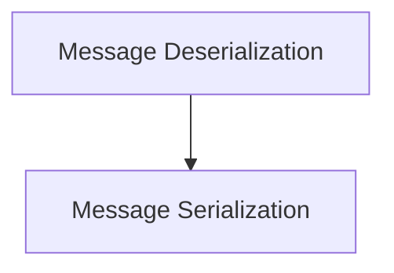

# Message Conversion Module

## Introduction
The `message_conversion` module, residing within `libs.partners.groq.langchain_groq.chat_models`, is responsible for the crucial task of converting various message formats. Specifically, it handles the bidirectional transformation between Groq API's message representations (dictionaries and message chunks) and LangChain's `BaseMessage` and `BaseMessageChunk` objects. This module ensures seamless communication between LangChain applications and the Groq chat models by standardizing message structures.

## Architecture
The module is logically divided into two primary sub-modules:

1. **Message Deserialization**: This sub-module focuses on converting incoming data from the Groq API into LangChain-compatible message objects.
2. **Message Serialization**: This sub-module handles the conversion of LangChain message objects into the dictionary format expected by the Groq API.

These sub-modules work in tandem to provide a robust and flexible message conversion layer, abstracting the complexities of different message formats from the rest of the system.

<!-- DIAGRAM_JSON
{
    "direction": "TD",
    "nodes": [
        {"id": "message_deserialization", "label": "Message Deserialization", "type": "module", "link": "message_deserialization.md"},
        {"id": "message_serialization", "label": "Message Serialization", "type": "module", "link": "message_serialization.md"}
    ],
    "edges": [
        {"source": "message_deserialization", "target": "message_serialization"}
    ],
    "groups": []
}
-->

## Sub-modules

Here are the sub-modules within `message_conversion`:

* [Message Deserialization](message_deserialization.md): Handles the conversion of raw message chunks and dictionaries into LangChain message objects.
* [Message Serialization](message_serialization.md): Manages the conversion of LangChain message objects into dictionary formats suitable for external APIs.
