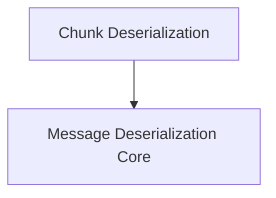

# Message Deserialization Module

## Introduction

The `message_deserialization` module is a critical component within the `partners.groq.langchain_groq.chat_models` package, specifically designed to handle the conversion of Groq API responses into standardized LangChain message objects. This module ensures seamless integration with the LangChain framework by transforming raw API output, whether full messages or streaming chunks, into a consistent and usable format.

## Purpose
The primary purpose of this module is to abstract away the complexities of parsing Groq's chat completion responses. It provides robust mechanisms to interpret different message types (e.g., user, assistant, system, function, tool messages) and their associated metadata, including tool calls, function calls, and usage information. This facilitates the development of applications that interact with Groq's chat models by providing a unified message representation.

## Architecture Overview

The `message_deserialization` module is structured into two main sub-modules, each responsible for a specific aspect of message conversion. These sub-modules work in tandem to support both synchronous and asynchronous message processing, adapting to the nature of the incoming data (full messages vs. streaming chunks).

<!-- DIAGRAM_JSON
{
    "direction": "TD",
    "nodes": [
        {"id": "chunk_deserialization", "label": "Chunk Deserialization", "type": "module", "link": "chunk_deserialization.md"},
        {"id": "message_deserialization_core", "label": "Message Deserialization Core", "type": "module", "link": "message_deserialization_core.md"}
    ],
    "edges": [
        {"source": "chunk_deserialization", "target": "message_deserialization_core"}
    ],
    "groups": []
}
-->

## Sub-modules

### [Chunk Deserialization](chunk_deserialization.md)
This sub-module focuses on converting individual message chunks from the Groq API into `BaseMessageChunk` objects. It is crucial for handling streaming responses, where messages are received incrementally. It accurately parses roles, content, and additional arguments like function and tool calls, ensuring that even partial message data is correctly structured.

### [Message Deserialization Core](message_deserialization_core.md)
This sub-module is responsible for transforming complete message dictionaries from the Groq API into `BaseMessage` objects. It handles the full lifecycle of a message conversion, including the extraction of content, roles, IDs, and complex structures such as tool calls and function calls, and additional metadata. This is used for non-streaming responses or when a complete message object is available.