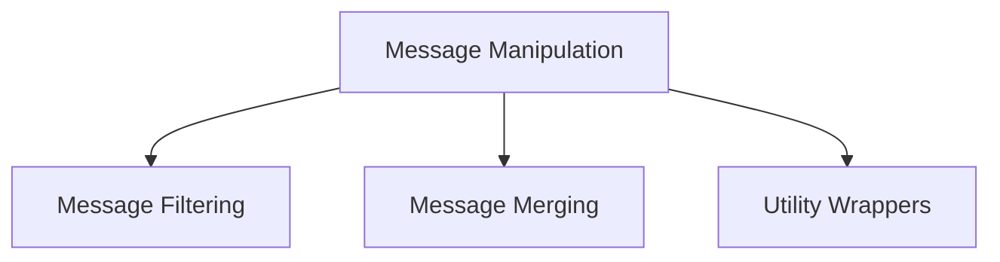

# Message Manipulation Module

The `message_manipulation` module provides essential utilities for processing and transforming messages within the Langchain Core framework. It encompasses functionalities for filtering, merging, and wrapping message-related operations, ensuring flexible and efficient handling of conversational data.

## Architecture

The module is composed of three main sub-modules, each dedicated to a specific aspect of message manipulation:

<!-- DIAGRAM_JSON
{
    "direction": "TD",
    "nodes": [
        {"id": "message_filtering", "label": "Message Filtering", "type": "module", "link": "message_filtering.md"},
        {"id": "message_merging", "label": "Message Merging", "type": "module", "link": "message_merging.md"},
        {"id": "utility_wrappers", "label": "Utility Wrappers", "type": "module", "link": "utility_wrappers.md"}
    ],
    "edges": [
        {"source": "message_manipulation", "target": "message_filtering"},
        {"source": "message_manipulation", "target": "message_merging"},
        {"source": "message_manipulation", "target": "utility_wrappers"}
    ],
    "groups": []
}
-->

## Sub-modules

### [Message Filtering](message_filtering.md)
This sub-module focuses on intelligently filtering messages based on various criteria, such as sender names, message types, and unique identifiers. It allows for precise control over which messages are processed or displayed.

### [Message Merging](message_merging.md)
The `message_merging` sub-module is responsible for combining consecutive messages of the same type into a single, cohesive message. This is particularly useful for optimizing storage and presentation of chat histories.

### [Utility Wrappers](utility_wrappers.md)
This sub-module provides a set of general-purpose utility functions designed to wrap other functions. It enhances code reusability and simplifies the integration of message manipulation logic into broader applications.