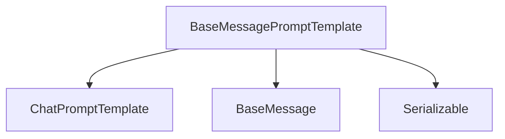

# message_prompt_templates Module Documentation

## Introduction
The `message_prompt_templates` module is a fundamental component within the `core_prompts` package, specifically designed to provide a foundational abstract base class for creating message-based prompt templates. It defines the core interface for structuring and formatting prompts as a list of `BaseMessage` objects, which are essential for interacting with chat-oriented language models. This module ensures consistency and extensibility across different types of message prompt templates in the system.

## Purpose and Core Functionality
The primary purpose of `BaseMessagePromptTemplate` is to establish a contract for any class that aims to generate a list of messages from a set of input variables. This abstraction allows for diverse implementations of message templating while adhering to a common interface, making it easier for the larger system to integrate and utilize various prompt template strategies.

The module's core functionality is encapsulated in the `BaseMessagePromptTemplate` class:
*   **Abstract Message Formatting**: It defines the `format_messages` abstract method, which concrete implementations must provide to transform input keyword arguments into a list of `BaseMessage` objects. An asynchronous version, `aformat_messages`, is also provided with a default synchronous implementation.
*   **Input Variable Management**: The `input_variables` property, also abstract, ensures that all message prompt templates explicitly declare the variables they expect for formatting.
*   **Serialization**: Inheriting from `Serializable`, the class supports serialization, enabling easy storage and retrieval of prompt templates.
*   **Composition**: The `__add__` method allows for the elegant composition of `BaseMessagePromptTemplate` instances with other prompt templates, typically `ChatPromptTemplate`, facilitating the construction of complex prompt chains.

## Architecture and Component Relationships

The `message_prompt_templates` module, through its `BaseMessagePromptTemplate`, plays a crucial role in the prompt construction pipeline. It acts as an interface that other modules can implement to provide specific message templating logic.

<!-- DIAGRAM_JSON
{
    "direction": "TD",
    "nodes": [
        {"id": "base_message_prompt_template", "label": "BaseMessagePromptTemplate", "type": "component", "link": null},
        {"id": "chat_prompt_template", "label": "ChatPromptTemplate", "type": "external", "link": "chat_prompt_templates.md"},
        {"id": "base_message", "label": "BaseMessage", "type": "external", "link": "core_messages.md"},
        {"id": "serializable", "label": "Serializable", "type": "external", "link": "core_load.md"}
    ],
    "edges": [
        {"source": "base_message_prompt_template", "target": "chat_prompt_template"},
        {"source": "base_message_prompt_template", "target": "base_message"},
        {"source": "base_message_prompt_template", "target": "serializable"}
    ],
    "groups": []
}
-->

### Component Relationships:
*   **`BaseMessagePromptTemplate`**: The core component of this module, serving as an abstract base for all message prompt templates.
*   **`ChatPromptTemplate`**: A concrete prompt template that can combine multiple `BaseMessagePromptTemplate` instances. The `BaseMessagePromptTemplate`'s `__add__` method uses and integrates with this module to create more complex prompt structures.
*   **`BaseMessage`**: Represents a single message in a chat-based interaction. `BaseMessagePromptTemplate` instances are designed to output lists of `BaseMessage` objects, making it a critical dependency for defining the output format.
*   **`Serializable`**: Provides the foundational serialization capabilities, allowing `BaseMessagePromptTemplate` and its descendants to be easily converted to and from various data formats. This is crucial for persistence and interoperability within the system.

## How the Module Fits into the Overall System
The `message_prompt_templates` module is a cornerstone of the prompt engineering capabilities within the `core_prompts` system. It enables the creation of flexible and dynamic prompts tailored for conversational AI applications. By providing a standardized interface for message formatting, it allows different language model integrations and application-specific logic to seamlessly generate coherent and structured chat inputs.

It works in conjunction with:
*   **[chat_prompt_templates.md](chat_prompt_templates.md)**: `BaseMessagePromptTemplate` serves as the building block for constructing `ChatPromptTemplate` instances, which aggregate multiple message templates to form a complete chat prompt.
*   **[core_messages.md](core_messages.md)**: The module's output, a list of `BaseMessage` objects, directly feeds into components that process and interact with language models, ensuring that prompts are correctly structured according to the `core_messages` definitions.
*   **[core_load.md](core_load.md)**: The `Serializable` inheritance enables the robust loading and saving of prompt template configurations, supporting dynamic system behavior and configuration persistence.

In essence, `message_prompt_templates` is the abstract bridge between raw input data and the structured message formats required by chat models, ensuring that prompts are consistently and effectively prepared for generation.
