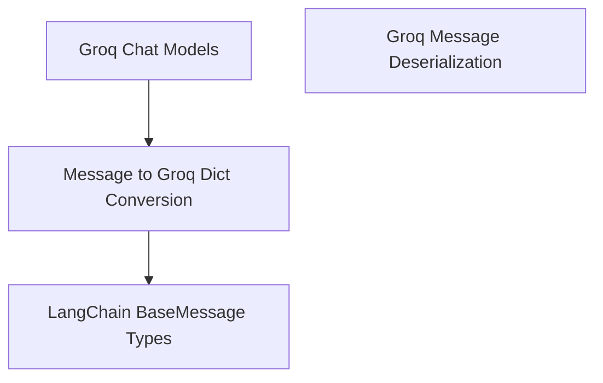

# message_serialization Module Documentation

## Introduction
The `message_serialization` module provides the core functionality for converting various `LangChain` message types into a dictionary format compatible with the Groq API. This ensures seamless communication between `LangChain` applications and Groq's chat models.

## Module Purpose and Core Functionality
The primary purpose of this module is to serialize `LangChain`'s abstract message representations into a structured dictionary format that the Groq API can understand and process. This involves handling different message roles (human, AI, system, function, tool) and their specific content structures, including text, content blocks, function calls, and tool calls.

The main component, `_convert_message_to_dict`, intelligently processes incoming `BaseMessage` objects:
-   **Role Mapping:** Translates `LangChain` message types (e.g., `HumanMessage`, `AIMessage`, `SystemMessage`) into corresponding Groq API roles (`user`, `assistant`, `system`).
-   **Content Formatting:** Ensures message content is correctly formatted. For `AIMessage`s, it specifically handles potential `v1` content conversions and filters out non-text `tool_call` blocks, as the Groq API primarily expects text content or explicit `tool_calls`.
-   **Function and Tool Call Handling:** Extracts and formats `function_call` and `tool_calls` from `AIMessage` and `FunctionMessage`/`ToolMessage` objects, ensuring they adhere to the Groq API's expected structure. It also ensures that the `content` field is set to `None` if only function/tool calls are present, aligning with API expectations.
-   **Additional Arguments:** Incorporates additional keyword arguments like `name` if provided in the `LangChain` message's `additional_kwargs`.

## Architecture and Component Relationships

<!-- DIAGRAM_JSON
{
    "direction": "TD",
    "nodes": [
        {"id": "message_serialization_func", "label": "Message to Groq Dict Conversion", "type": "component", "link": null},
        {"id": "base_message_types", "label": "LangChain BaseMessage Types", "type": "external", "link": "core_messages.md"},
        {"id": "groq_chat_models_module", "label": "Groq Chat Models", "type": "external", "link": "partners_groq_chat_models.md"},
        {"id": "message_deserialization_module", "label": "Groq Message Deserialization", "type": "external", "link": "message_deserialization.md"}
    ],
    "edges": [
        {"source": "groq_chat_models_module", "target": "message_serialization_func"},
        {"source": "message_serialization_func", "target": "base_message_types"}
    ],
    "groups": []
}
-->

The `message_serialization` module (represented by `Message to Groq Dict Conversion`) is a key component within the [partners_groq_chat_models](../partners_groq_chat_models.md) module. It consumes various `LangChain BaseMessage Types` (from the [core_messages](../core_messages.md) module) and transforms them into a format suitable for the Groq API.

It works in conjunction with its sibling module, [message_deserialization](../message_deserialization.md), which handles the inverse process of converting Groq API responses back into `LangChain` message objects. Together, these two modules form the `message_conversion` sub-module, ensuring full bidirectional compatibility with Groq's chat models.

## How the Module Fits into the Overall System
This module is crucial for integrating `LangChain` applications with Groq's language models. When a `LangChain` application sends messages to a Groq chat model, the `_convert_message_to_dict` function acts as an intermediary, translating the `LangChain` message objects into the specific JSON format expected by the Groq API. Without this serialization layer, `LangChain` messages would not be correctly interpreted by the Groq API, preventing successful communication and model interaction. It ensures that complex message structures, including tool calls and content blocks, are correctly represented, facilitating advanced agentic workflows and structured outputs.

This module is directly used by the higher-level [partners_groq_chat_models](../partners_groq_chat_models.md) module to prepare requests before sending them to the Groq API. It forms a fundamental part of the Groq integration within the `LangChain` ecosystem, enabling developers to leverage Groq's capabilities using the familiar `LangChain` interface.