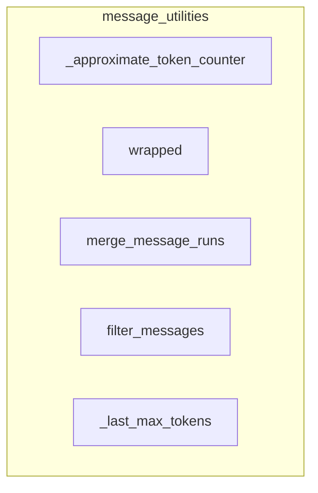

# message_utilities
This module provides various utility functions for processing and manipulating message objects, including token counting, message merging, filtering, and truncation based on token limits.

<!-- DIAGRAM_JSON
{
  "nodes": [
    {"id": "_approximate_token_counter", "label": "_approximate_token_counter"},
    {"id": "wrapped", "label": "wrapped"},
    {"id": "merge_message_runs", "label": "merge_message_runs"},
    {"id": "filter_messages", "label": "filter_messages"},
    {"id": "_last_max_tokens", "label": "_last_max_tokens"}
  ],
  "edges": [],
  "groups": [
    {
      "id": "message_utilities",
      "label": "message_utilities",
      "nodes": [
        "_approximate_token_counter",
        "wrapped",
        "merge_message_runs",
        "filter_messages",
        "_last_max_tokens"
      ]
    }
  ]
}
-->
