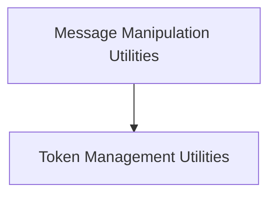

# Message Utilities (`message_utils`)

## Introduction and Purpose

The `message_utils` module provides essential utility functions for handling and manipulating `BaseMessage` objects within the LangChain Core. This module is crucial for tasks such as filtering message sequences, merging consecutive messages of the same type, wrapping functions for runnable compatibility, and managing token counts.

Its primary purpose is to offer a set of robust and flexible tools that facilitate the processing and transformation of chat messages, ensuring efficient and coherent interaction within various language model applications.

## Architecture Overview

The `message_utils` module is composed of several key sub-modules, each focusing on a specific aspect of message handling. These sub-modules work together to provide a comprehensive suite of utilities for message manipulation and token management.

<!-- DIAGRAM_JSON
{
    "direction": "TD",
    "nodes": [
        {"id": "message_manipulation", "label": "Message Manipulation Utilities", "type": "module", "link": "message_manipulation.md"},
        {"id": "token_management", "label": "Token Management Utilities", "type": "module", "link": "token_management.md"}
    ],
    "edges": [
        {"source": "message_manipulation", "target": "token_management"}
    ],
    "groups": []
}
-->

## Sub-modules

### [Message Manipulation Utilities](message_manipulation.md)
This sub-module offers functions for filtering, merging, and wrapping message-like representations, crucial for structuring conversational flows.

### [Token Management Utilities](token_management.md)
This sub-module provides utilities for approximating token counts and managing message lengths based on token limits, essential for controlling context windows and API costs.
