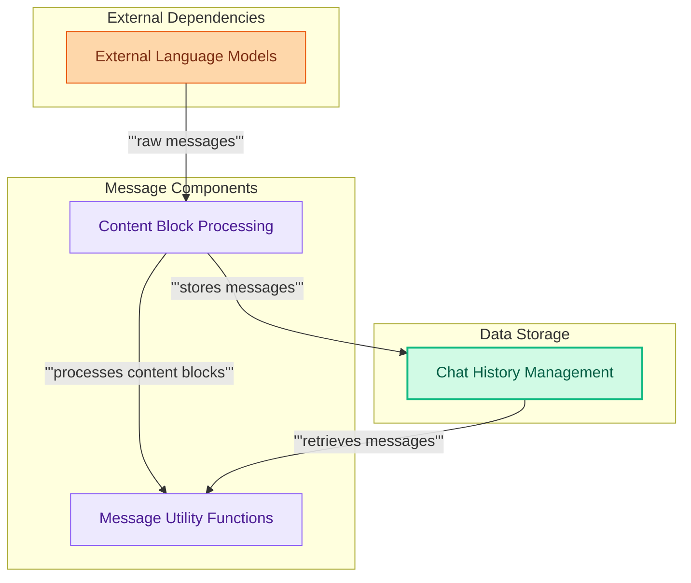

# Message and History Management
Manages chat messages and conversation history, providing tools to translate content blocks from diverse AI providers. It standardizes message components and includes utilities for message processing, filtering, and token counting.

<!-- DIAGRAM_JSON
{
    "direction": "TD",
    "nodes": [
        {
            "id": "external_models",
            "label": "External Language Models",
            "type": "external"
        },
        {
            "id": "content_blocks",
            "label": "Content Block Processing",
            "type": "module",
            "link": "content_blocks.md"
        },
        {
            "id": "chat_history",
            "label": "Chat History Management",
            "type": "module",
            "link": "chat_history.md"
        },
        {
            "id": "message_utilities",
            "label": "Message Utility Functions",
            "type": "module",
            "link": "message_utilities.md"
        }
    ],
    "edges": [
        {
            "source": "external_models",
            "target": "content_blocks",
            "label": "raw messages"
        },
        {
            "source": "content_blocks",
            "target": "chat_history",
            "label": "stores messages"
        },
        {
            "source": "content_blocks",
            "target": "message_utilities",
            "label": "processes content blocks"
        },
        {
            "source": "chat_history",
            "target": "message_utilities",
            "label": "retrieves messages"
        }
    ],
    "groups": [
        {
            "id": "external",
            "label": "External Dependencies",
            "role": "generative",
            "nodes": [
                "external_models"
            ]
        },
        {
            "id": "message_components",
            "label": "Message Components",
            "role": "analytical",
            "nodes": [
                "content_blocks",
                "message_utilities"
            ]
        },
        {
            "id": "data_storage",
            "label": "Data Storage",
            "role": "data",
            "nodes": [
                "chat_history"
            ]
        }
    ]
}
-->
