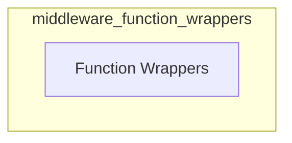

# Middleware Function Wrappers

## Introduction

The `middleware_function_wrappers` module provides core utilities for wrapping agent middleware functions, enabling consistent handling of both synchronous and asynchronous tool call requests within the LangChain v1 agent framework. It serves as a foundational component for applying various middleware behaviors to agent operations.

## Architecture Overview

This module is a part of the `langchain_v1_agents_middleware` system, specifically residing within the `middleware_types.middleware_wrappers` sub-structure. Its primary role is to offer standardized wrapper functions that facilitate the integration of custom middleware logic.

<!-- DIAGRAM_JSON
{
    "direction": "TD",
    "nodes": [
        {"id": "function_wrappers", "label": "Function Wrappers", "type": "module", "link": "function_wrappers.md"}
    ],
    "edges": []
}
-->

## Sub-modules

### [Function Wrappers](function_wrappers.md)

The `function_wrappers` sub-module contains the core logic for creating wrapper functions. It defines both `async_wrapped` and `wrapped` functions, which are essential for standardizing how middleware processes tool call requests, whether they are asynchronous or synchronous. This ensures that middleware components can be uniformly applied across different operational contexts without needing to differentiate between async/sync implementations at the middleware logic level.

For detailed information, refer to the [Function Wrappers documentation](function_wrappers.md).