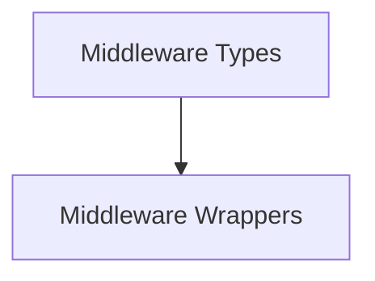

# Middleware Types Module

The `middleware_types` module defines the fundamental types and wrapper functions used within the agent middleware system. It provides the core structures for handling tool call requests and ensuring proper execution flow, both synchronously and asynchronously.

## Architecture Overview

This module primarily consists of wrapper functions that facilitate the integration of middleware components into the agent's tool calling mechanism. It ensures that tool calls can be intercepted and processed by various middleware policies before execution.

<!-- DIAGRAM_JSON
{
    "direction": "TD",
    "nodes": [
        {"id": "middleware_types", "label": "Middleware Types", "type": "module"},
        {"id": "middleware_wrappers", "label": "Middleware Wrappers", "type": "module", "link": "middleware_wrappers.md"}
    ],
    "edges": [
        {"source": "middleware_types", "target": "middleware_wrappers"}
    ],
    "groups": []
}
-->

## Sub-modules

### [Middleware Wrappers](middleware_wrappers.md)
This sub-module provides synchronous and asynchronous wrapper functions for handling tool call requests within agent middleware. It is crucial for intercepting and processing tool calls through various middleware policies.
