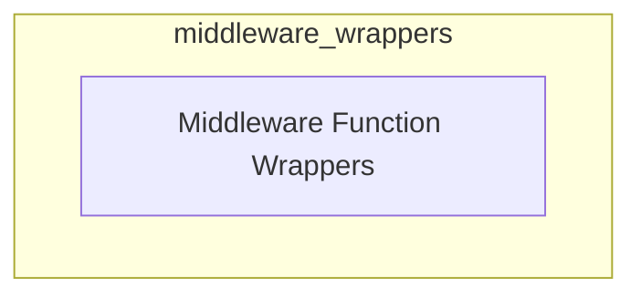

# Middleware Wrappers Module

The `middleware_wrappers` module provides essential utility functions for defining and applying middleware within the agent system. Its primary purpose is to offer consistent patterns for wrapping synchronous and asynchronous functions that handle tool call requests and responses, ensuring that middleware logic can be seamlessly integrated into the agent's execution flow.

## Architecture

The `middleware_wrappers` module is a small, focused utility module within the broader `langchain_v1.langchain.agents.middleware.types` structure. It directly exposes core wrapper functions, which are then utilized by various middleware components for consistent function interception and processing.

<!-- DIAGRAM_JSON
{
    "direction": "TD",
    "nodes": [
        {"id": "middleware_function_wrappers", "label": "Middleware Function Wrappers", "type": "module", "link": "middleware_function_wrappers.md"}
    ],
    "edges": [],
    "groups": []
}
-->

## Sub-modules

### Middleware Function Wrappers (`middleware_function_wrappers.md`)
This sub-module contains the core synchronous and asynchronous wrapper functions (`wrapped` and `async_wrapped`) that facilitate the application of middleware logic to agent tool calls. These wrappers abstract away the complexity of handling function signatures and provide a standardized interface for middleware developers.

For more detailed information, refer to the [Middleware Function Wrappers documentation](middleware_function_wrappers.md).