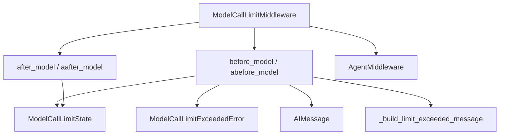

# model_call_limit Module Documentation

The `model_call_limit` module provides a crucial middleware component for managing and enforcing limits on model calls within an agent's execution. This helps prevent excessive usage of language models, control costs, and ensure agent stability by allowing developers to define maximum call counts per thread or per individual agent run.

### Comprehensive Documentation

The `model_call_limit` module primarily consists of the `ModelCallLimitMiddleware` class, which integrates with the agent's lifecycle to monitor and react to model call counts.

#### `ModelCallLimitMiddleware`

The `ModelCallLimitMiddleware` is an `AgentMiddleware` that tracks the number of times a language model is invoked during an agent's operation. It supports two types of limits:

*   **Thread-level limit**: Tracks model calls across multiple invocations (runs) of the same agent thread.
*   **Run-level limit**: Tracks model calls within a single invocation (run) of the agent.

When a defined limit is exceeded, the middleware can be configured to either gracefully `end` the agent's execution by injecting an informative message or `error` out, raising a `ModelCallLimitExceededError`.

**Key Features:**

*   **Configurable Limits**: Set `thread_limit` and `run_limit` to `None` for no limit, or an integer for a maximum. At least one limit must be specified during initialization.
*   **Exit Behavior**: Choose between `"end"` (injects an `AIMessage` and jumps to the end of the run) and `"error"` (raises `ModelCallLimitExceededError`).
*   **Synchronous and Asynchronous Hooks**: Implements `before_model`, `abefore_model`, `after_model`, and `aafter_model` hooks to check limits before a call and increment counts after a call, supporting both synchronous and asynchronous agent execution.
*   **State Management**: Utilizes `ModelCallLimitState` to store and update `thread_model_call_count` and `run_model_call_count` within the agent's state.

**Initialization Parameters:**

*   `thread_limit` (int | None): The maximum number of model calls allowed across the lifespan of a thread.
*   `run_limit` (int | None): The maximum number of model calls allowed within a single agent run.
*   `exit_behavior` (Literal["end", "error"]): Determines the action when a limit is exceeded.
    *   `"end"`: Terminates the agent gracefully with a message.
    *   `"error"`: Raises a `ModelCallLimitExceededError`.

**Raises:**

*   `ValueError`: If both `thread_limit` and `run_limit` are `None`, or if `exit_behavior` is not `"end"` or `"error"`.
*   `ModelCallLimitExceededError`: If a limit is exceeded and `exit_behavior` is set to `"error"`.

### Architecture and Component Relationships

The `model_call_limit` module is a leaf module within the `langchain_v1_agents_middleware` system. It directly interacts with the agent's state and core messaging components.

<!-- DIAGRAM_JSON
{
    "direction": "TD",
    "nodes": [
        {"id": "model_call_limit_middleware", "label": "ModelCallLimitMiddleware", "type": "component", "link": null},
        {"id": "before_model_hook", "label": "before_model / abefore_model", "type": "component", "link": null},
        {"id": "after_model_hook", "label": "after_model / aafter_model", "type": "component", "link": null},
        {"id": "model_call_limit_state", "label": "ModelCallLimitState", "type": "component", "link": null},
        {"id": "model_call_limit_exceeded_error", "label": "ModelCallLimitExceededError", "type": "component", "link": null},
        {"id": "_build_limit_exceeded_message", "label": "_build_limit_exceeded_message", "type": "component", "link": null},
        {"id": "middleware_base", "label": "AgentMiddleware", "type": "external", "link": "middleware_types.md"},
        {"id": "ai_message", "label": "AIMessage", "type": "external", "link": "core_messages.md"}
    ],
    "edges": [
        {"source": "model_call_limit_middleware", "target": "middleware_base"},
        {"source": "model_call_limit_middleware", "target": "before_model_hook"},
        {"source": "model_call_limit_middleware", "target": "after_model_hook"},
        {"source": "before_model_hook", "target": "model_call_limit_state"},
        {"source": "before_model_hook", "target": "model_call_limit_exceeded_error"},
        {"source": "before_model_hook", "target": "ai_message"},
        {"source": "before_model_hook", "target": "_build_limit_exceeded_message"},
        {"source": "after_model_hook", "target": "model_call_limit_state"}
    ],
    "groups": []
}
-->

### How the Module Fits into the Overall System

The `model_call_limit` module is an integral part of the [langchain_v1_agents_middleware](langchain_v1_agents_middleware.md) system. It provides a non-functional but critical aspect of agent management: resource control. By offering a plug-and-play mechanism to limit model calls, it allows developers to build more robust and cost-effective agents. It works in conjunction with other middleware components to form a comprehensive agent execution pipeline.

Its dependency on [middleware_types](middleware_types.md) for its base `AgentMiddleware` class and on [core_messages](core_messages.md) for generating `AIMessage` responses when limits are exceeded, highlights its integration with the core components of the LangChain framework. This modular design allows it to be easily included or excluded from an agent's configuration based on specific application requirements.