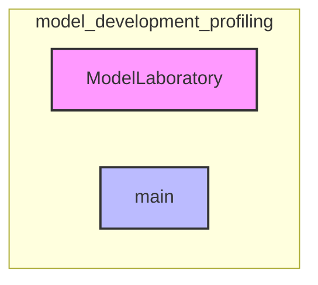

# model_development_profiling
This module offers a `ModelLaboratory` for experimenting with and comparing language models, and a CLI entrypoint (`main`) for refreshing model profile data from external sources.

<!-- DIAGRAM_JSON
{
  "nodes": [
    {"id": "A", "label": "ModelLaboratory", "type": "class"},
    {"id": "B", "label": "main", "type": "function"}
  ],
  "edges": [],
  "groups": [
    {"id": "model_development_profiling", "label": "model_development_profiling", "contains": ["A", "B"]}
  ]
}
-->
