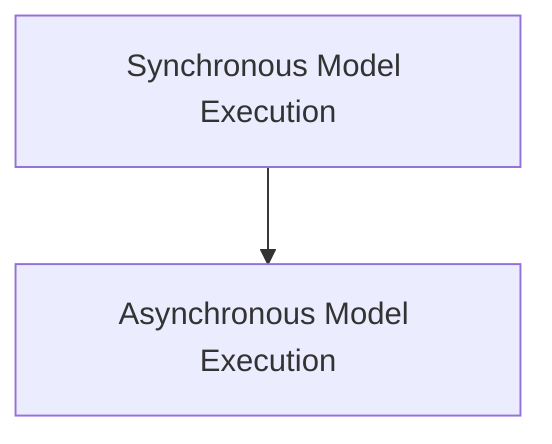

# Model Execution Handlers

The `model_execution_handlers` module is responsible for orchestrating the execution of language model requests within the agent factory. It provides mechanisms for both synchronous and asynchronous model interactions, incorporating middleware for request pre-processing and response post-processing.

## Architecture

The module's architecture is designed to handle model invocations efficiently, allowing for flexible integration of various tools and system messages. It distinguishes between synchronous and asynchronous execution paths, each capable of applying custom middleware for extended functionality.

<!-- DIAGRAM_JSON
{
    "direction": "TD",
    "nodes": [
        {"id": "sync_model_execution", "label": "Synchronous Model Execution", "type": "module", "link": "sync_model_execution.md"},
        {"id": "async_model_execution", "label": "Asynchronous Model Execution", "type": "module", "link": "async_model_execution.md"}
    ],
    "edges": [
        {"source": "sync_model_execution", "target": "async_model_execution"}
    ],
    "groups": []
}
-->

## Sub-modules

### [Synchronous Model Execution](sync_model_execution.md)
Handles synchronous model requests and integrates with middleware for processing.

### [Asynchronous Model Execution](async_model_execution.md)
Manages asynchronous model requests, including middleware integration and response normalization.
