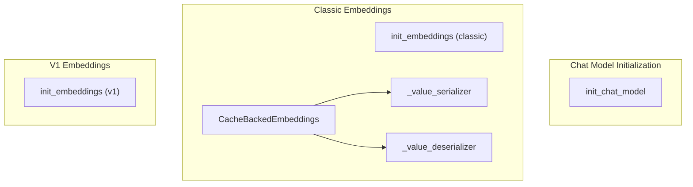

# model_init_and_integration
This module provides unified interfaces for initializing chat and embedding models from various providers, alongside a caching mechanism for embedding results. It includes distinct functions for classic and v1 embedding model initialization.

<!-- DIAGRAM_JSON
{
  "nodes": [
    {"id": "A", "label": "init_chat_model"},
    {"id": "B", "label": "init_embeddings (classic)"},
    {"id": "C", "label": "init_embeddings (v1)"},
    {"id": "D", "label": "CacheBackedEmbeddings"},
    {"id": "E", "label": "_value_serializer"},
    {"id": "F", "label": "_value_deserializer"}
  ],
  "edges": [
    {"source": "D", "target": "E"},
    {"source": "D", "target": "F"}
  ],
  "groups": [
    {"id": "group_chat_init", "label": "Chat Model Initialization", "nodes": ["A"]},
    {"id": "group_classic_embed", "label": "Classic Embeddings", "nodes": ["B", "D", "E", "F"]},
    {"id": "group_v1_embed", "label": "V1 Embeddings", "nodes": ["C"]}
  ]
}
-->
