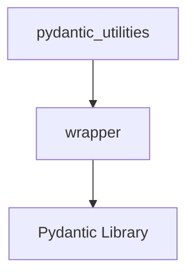

# Module: `model_initialization`

## Introduction
The `model_initialization` module provides a crucial utility for handling the pre-initialization logic of Pydantic models within the system. Its primary component, the `wrapper` function, acts as a decorator to manage default value assignment and field alias resolution, ensuring consistent and robust model instantiation.

## Purpose and Core Functionality
The main purpose of this module is to streamline the initialization process for Pydantic `BaseModel` instances. It addresses common challenges related to:

1.  **Field Alias Resolution**: Automatically maps values provided via Pydantic field aliases (e.g., `field_name` vs. `field_alias`) to their correct internal field names before model validation. This supports both Pydantic V1 (`allow_population_by_field_name`) and Pydantic V2 (`populate_by_name`) configurations.
2.  **Default Value Assignment**: Ensures that fields not explicitly provided during instantiation, but having a default value or a `default_factory`, are correctly populated. This prevents `None` values or missing fields for non-required fields that have defined defaults.

By centralizing this logic, the module reduces boilerplate code in model definitions and enhances the predictability of model creation across the system.

## Architecture and Component Relationships

The `model_initialization` module is a leaf module nestled within the `core_utils.pydantic_utilities` module. Its core functionality is encapsulated in a single decorator function.

### Core Components

*   **`wrapper` (Decorator)**: This function intercepts the `__init__` or `__post_init__` (conceptual) call for Pydantic models. It takes the model class (`cls`) and the raw input values (`values`) dictionary. It then modifies `values` to include aliased fields under their actual names and populates default values for missing non-required fields before passing the processed values to the original initialization logic.

### Relationships
The `wrapper` function directly interacts with Pydantic's `BaseModel` introspection capabilities, specifically `cls.model_fields`, to understand the model's schema, aliases, and default configurations. It acts as a pre-processor for any Pydantic model that it decorates or that is initialized through a mechanism leveraging this wrapper.

<!-- DIAGRAM_JSON
{
    "direction": "TD",
    "nodes": [
        {"id": "wrapper_func", "label": "wrapper", "type": "component", "link": null},
        {"id": "pydantic_utilities", "label": "pydantic_utilities", "type": "external", "link": "pydantic_utilities.md"},
        {"id": "pydantic_library", "label": "Pydantic Library", "type": "external", "link": null}
    ],
    "edges": [
        {"source": "wrapper_func", "target": "pydantic_library"},
        {"source": "pydantic_utilities", "target": "wrapper_func"}
    ],
    "groups": []
}
-->

## How the Module Fits into the Overall System

The `model_initialization` module serves as a foundational utility for any part of the system that heavily relies on Pydantic models for data validation, parsing, and serialization. By ensuring proper initialization, it contributes to:

*   **Robustness**: Reduces potential `KeyError` or `AttributeError` issues due to missing defaults or incorrect field names from aliases.
*   **Consistency**: Standardizes how Pydantic models are instantiated, regardless of whether input values use original field names or aliases.
*   **Maintainability**: Centralizes initialization logic, making it easier to update Pydantic versions or modify default handling without altering numerous model definitions.

It is an integral part of the broader [pydantic_utilities module](pydantic_utilities.md) which provides various helper functions for working with Pydantic, making the overall system more reliable and easier to develop against Pydantic's powerful features.