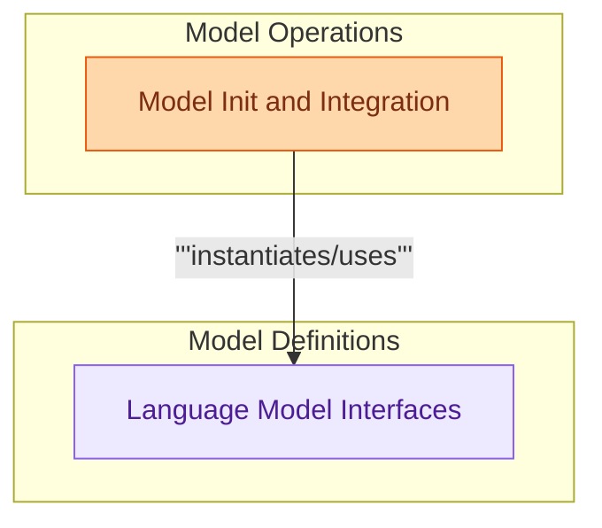

# Models and Embeddings

This module defines foundational interfaces for language models and provides utilities for their initialization, integration with various providers, and caching mechanisms for embeddings to optimize performance.

<!-- DIAGRAM_JSON
{
    "direction": "TD",
    "nodes": [
        {
            "id": "language_model_interfaces",
            "label": "Language Model Interfaces",
            "type": "module",
            "link": "language_model_interfaces.md"
        },
        {
            "id": "model_init_and_integration",
            "label": "Model Init and Integration",
            "type": "module",
            "link": "model_init_and_integration.md"
        }
    ],
    "edges": [
        {
            "source": "model_init_and_integration",
            "target": "language_model_interfaces",
            "label": "instantiates/uses"
        }
    ],
    "groups": [
        {
            "id": "model_definitions",
            "label": "Model Definitions",
            "role": "analytical",
            "nodes": [
                "language_model_interfaces"
            ]
        },
        {
            "id": "model_ops",
            "label": "Model Operations",
            "role": "generative",
            "nodes": [
                "model_init_and_integration"
            ]
        }
    ]
}
-->

