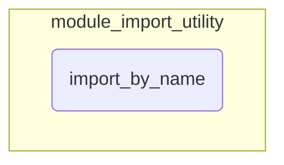

# module_import_utility
Provides a utility function for dynamically importing modules and their components by name, handling package restrictions, deprecation warnings, and common import errors.

<!-- DIAGRAM_JSON
{
    "nodes": [
        {
            "id": "module_import_utility",
            "label": "module_import_utility",
            "type": "module"
        },
        {
            "id": "import_by_name",
            "label": "import_by_name",
            "type": "function"
        }
    ],
    "edges": [
        {
            "source": "module_import_utility",
            "target": "import_by_name",
            "type": "contains"
        }
    ],
    "groups": [
        {
            "id": "module_import_utility_group",
            "label": "module_import_utility",
            "nodes": [
                "import_by_name"
            ]
        }
    ]
}
-->
