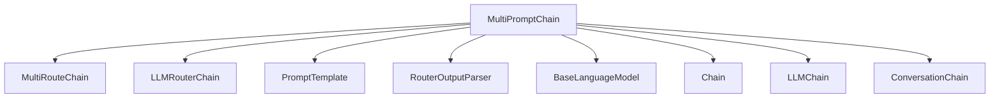

# `multi_prompt_chain_module`

## Introduction

The `multi_prompt_chain_module` provides the `MultiPromptChain` class, a deprecated component within the classic LangChain framework. This chain facilitates dynamic routing of user queries to different specialized prompt-based chains based on an initial routing decision made by an LLM router. Although deprecated, understanding its functionality offers insight into earlier patterns for constructing adaptive conversational agents.

## Architecture and Core Components

The `MultiPromptChain` is designed to act as a central dispatcher, directing incoming prompts to the most appropriate sub-chain for processing. It achieves this by utilizing an `LLMRouterChain` to analyze the input and determine the correct "destination" chain.

<!-- DIAGRAM_JSON
{
    "direction": "TD",
    "nodes": [
        {"id": "multi_prompt_chain", "label": "MultiPromptChain", "type": "component", "link": null},
        {"id": "multi_route_chain", "label": "MultiRouteChain", "type": "external", "link": "classic_chains_router.md"},
        {"id": "llm_router_chain", "label": "LLMRouterChain", "type": "external", "link": "llm_router_chain_module.md"},
        {"id": "prompt_template", "label": "PromptTemplate", "type": "external", "link": "core_prompts.md"},
        {"id": "router_output_parser", "label": "RouterOutputParser", "type": "external", "link": "classic_chains_router.md"},
        {"id": "base_language_model", "label": "BaseLanguageModel", "type": "external", "link": "core_language_models.md"},
        {"id": "chain", "label": "Chain", "type": "external", "link": "classic_chains_base.md"},
        {"id": "llm_chain", "label": "LLMChain", "type": "external", "link": "classic_chains_base.md"},
        {"id": "conversation_chain", "label": "ConversationChain", "type": "external", "link": "classic_chains_conversational.md"}
    ],
    "edges": [
        {"source": "multi_prompt_chain", "target": "multi_route_chain"},
        {"source": "multi_prompt_chain", "target": "llm_router_chain"},
        {"source": "multi_prompt_chain", "target": "prompt_template"},
        {"source": "multi_prompt_chain", "target": "router_output_parser"},
        {"source": "multi_prompt_chain", "target": "base_language_model"},
        {"source": "multi_prompt_chain", "target": "chain"},
        {"source": "multi_prompt_chain", "target": "llm_chain"},
        {"source": "multi_prompt_chain", "target": "conversation_chain"}
    ],
    "groups": []
}
-->

### `MultiPromptChain`

- **Purpose**: A multi-route chain that utilizes an LLM router to select among various predefined prompts/chains. It serves as a dispatcher to specialized sub-chains based on the input query.
- **Key Functionality**:
    - **Routing**: Employs an `LLMRouterChain` to analyze the input and decide which "destination" chain is most appropriate to handle the query.
    - **`from_prompts` Constructor**: A convenience class method to instantiate the `MultiPromptChain` from a list of prompt information (`prompt_infos`), an `LLM`, and an optional `default_chain`.
    - **Output**: Returns a dictionary with a single key `text`, representing the output of the selected destination chain.

### Relationships to Other Modules

- **Inheritance**: `MultiPromptChain` inherits from `MultiRouteChain` from the [classic_chains_router.md](classic_chains_router.md) module, establishing its role within the routing chain hierarchy.
- **Routing Logic**: It heavily relies on the `LLMRouterChain` which is defined in the [llm_router_chain_module.md](llm_router_chain_module.md) to perform the intelligent routing based on prompt information.
- **Prompting**: Uses `PromptTemplate` from [core_prompts.md](core_prompts.md) to construct the prompts for both the router and the destination chains.
- **Output Parsing**: Leverages `RouterOutputParser` also from the [classic_chains_router.md](classic_chains_router.md) to interpret the output of the router LLM.
- **Language Models**: Interacts with `BaseLanguageModel` from [core_language_models.md](core_language_models.md) to integrate with various language models.
- **Base Chain Components**: Utilizes `Chain` and `LLMChain` from [classic_chains_base.md](classic_chains_base.md) as foundational components for its destination chains.
- **Default Behavior**: When no specific destination chain is matched, it can fall back to a `ConversationChain` from [classic_chains_conversational.md](classic_chains_conversational.md).

## Usage and Deprecation

While functional, `MultiPromptChain` is officially deprecated. The provided code snippet illustrates an alternative implementation using LangGraph, which offers enhanced capabilities like streaming and batch support. Developers are encouraged to migrate to the recommended LangGraph-based approach for building multi-prompt routing logic.

The deprecation reflects an evolution in how complex chains are constructed, moving towards more flexible and performant frameworks like LangGraph. The example provided within the `MultiPromptChain`'s docstring serves as a direct guide for this migration, showcasing how to achieve similar routing functionality with a modern approach.