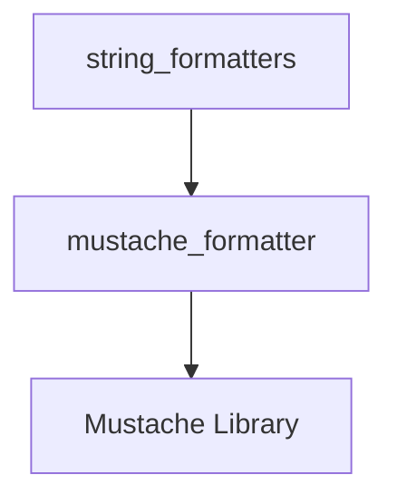

# mustache_formatting Module Documentation

## Introduction

The `mustache_formatting` module provides functionality for formatting prompt templates using the Mustache templating engine. It offers a simple and robust way to inject dynamic values into predefined string templates, which is essential for constructing flexible and reusable prompts for language models.

## Architecture and Component Relationships

The `mustache_formatting` module is a leaf module within the `core_prompts` hierarchy, specifically nested under `core_prompts` -> `prompt_formatters` -> `string_formatters`. Its primary component is the `mustache_formatter` function, which leverages an external Mustache library to perform the actual template rendering.

<!-- DIAGRAM_JSON
{
    "direction": "TD",
    "nodes": [
        {"id": "mustache_formatter_func", "label": "mustache_formatter", "type": "component", "link": null},
        {"id": "mustache_library", "label": "Mustache Library", "type": "external", "link": null},
        {"id": "string_formatters", "label": "string_formatters", "type": "external", "link": "string_formatters.md"}
    ],
    "edges": [
        {"source": "mustache_formatter_func", "target": "mustache_library"},
        {"source": "string_formatters", "target": "mustache_formatter_func"}
    ],
    "groups": []
}
-->

## How the Module Fits into the Overall System

This module plays a crucial role in the `core_prompts` system by providing one of the supported mechanisms for dynamically formatting prompt strings. It allows developers to define prompt templates with placeholders (Mustache syntax) and then populate these placeholders with runtime data, creating a complete prompt string suitable for input to a language model. It integrates seamlessly into the prompt construction pipeline, enabling flexible prompt engineering and personalization.