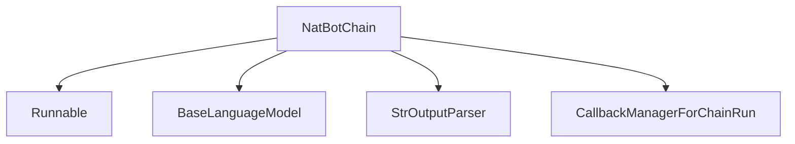

# NatBot Chain Module Documentation

## Introduction

The `natbot_chain_module` provides the `NatBotChain` class, a specialized chain designed to enable LLM-driven browser automation. This module allows an LLM to interact with web pages by generating browser commands based on a given objective and the current browser content. It is a critical component for building applications that require automated web navigation and interaction.

## Purpose and Core Functionality

The primary purpose of the `NatBotChain` is to act as an "LLM driven browser." It takes an overall objective and the current state of a web page (URL and content) to determine the next action the browser should take. This enables intelligent automation of complex web tasks.

**Core Functionality:**
*   **LLM-driven Command Generation**: Leverages a Language Model to interpret user objectives and browser content, outputting the appropriate browser command (e.g., clicking a link, typing into a field).
*   **State Management**: Maintains `previous_command` to provide context to the LLM for subsequent actions, facilitating multi-step interactions.
*   **Flexible Initialization**: Can be initialized using an `llm_chain` directly or via a convenience `from_llm` class method that constructs a default `llm_chain`.

**Security Note:** It is crucial to be aware of the security implications when using `NatBotChain`. This module controls a web browser, which can navigate to any URL (including internal network resources) and local files. Therefore, it is essential to restrict access to this chain and isolate the network environment where it operates, especially if exposed to end-users. Refer to the LangChain security policy for detailed guidance.

## Architecture and Component Relationships

The `natbot_chain_module` is centered around the `NatBotChain` class, which orchestrates the interaction between the LLM and the browser. It integrates with several core LangChain components to achieve its functionality.

<!-- DIAGRAM_JSON
{
    "direction": "TD",
    "nodes": [
        {"id": "natbot_chain", "label": "NatBotChain", "type": "component", "link": null},
        {"id": "core_language_models", "label": "BaseLanguageModel", "type": "external", "link": "core_language_models.md"},
        {"id": "core_runnables", "label": "Runnable", "type": "external", "link": "core_runnables.md"},
        {"id": "core_output_parsers", "label": "StrOutputParser", "type": "external", "link": "core_output_parsers.md"},
        {"id": "core_callbacks", "label": "CallbackManagerForChainRun", "type": "external", "link": "core_callbacks.md"}
    ],
    "edges": [
        {"source": "natbot_chain", "target": "core_runnables"},
        {"source": "natbot_chain", "target": "core_language_models"},
        {"source": "natbot_chain", "target": "core_output_parsers"},
        {"source": "natbot_chain", "target": "core_callbacks"}
    ],
    "groups": []
}
-->

**Component Breakdown:**

### `NatBotChain`
-   **Purpose**: The main class for LLM-driven browser automation.
-   **Attributes**:
    -   `llm_chain` (Runnable): The underlying runnable that invokes the LLM with the prompt, LLM, and output parser.
    -   `objective` (str): The overall task the NatBot is trying to accomplish.
    -   `llm` (BaseLanguageModel | None): [Deprecated] Direct LLM instance. Users should prefer `llm_chain` or `from_llm`.
    -   `input_url_key`, `input_browser_content_key`, `output_key`: Keys used for input and output dictionaries.
    -   `previous_command` (str): Stores the last command issued to provide context for the next action.
-   **Methods**:
    -   `_raise_deprecation`: A class method validator that handles deprecation of direct `llm` instantiation, guiding users to `llm_chain` or `from_llm`.
    -   `from_default`: [Deprecated] Class method to load with a default `LLMChain`. Users are advised to use `from_llm`.
    -   `from_llm(llm: BaseLanguageModel, objective: str, **kwargs: Any) -> NatBotChain`: A factory method to create an `NatBotChain` instance from a `BaseLanguageModel` and an `objective`. It constructs the internal `llm_chain` using a predefined `PROMPT`, the provided `llm`, and `StrOutputParser`.
    -   `input_keys` (property): Returns the expected input keys (`input_url_key`, `input_browser_content_key`).
    -   `output_keys` (property): Returns the output key (`output_key`).
    -   `_call(inputs: dict[str, str], run_manager: CallbackManagerForChainRun | None = None) -> dict[str, str]`: The core logic for invoking the LLM chain with the current objective, URL, previous command, and browser content to get the next command.
    -   `execute(url: str, browser_content: str) -> str`: A convenience method to directly execute the chain with URL and browser content, returning the next browser command.
    -   `_chain_type` (property): Returns "nat_bot_chain".

## How the Module Fits into the Overall System

The `natbot_chain_module` is part of the `classic_chains_specialized.web_automation_chains` within the broader LangChain framework. It provides a high-level abstraction for implementing intelligent web agents that can interact with websites autonomously. This module is particularly useful in scenarios requiring:

*   **Automated Data Extraction**: Navigating dynamic websites to collect information.
*   **Web Testing and QA**: Simulating user interactions for testing purposes.
*   **Personalized Web Assistants**: Creating agents that can perform tasks on behalf of a user in a web browser context.

It relies on core LangChain primitives like [Runnables](core_runnables.md) for chain construction, [BaseLanguageModel](core_language_models.md) for LLM interaction, and [StrOutputParser](core_output_parsers.md) for processing LLM output. The integration with [CallbackManagerForChainRun](core_callbacks.md) allows for observability and custom handling during chain execution. Its position within `classic_chains_specialized` highlights its role as a powerful, task-specific chain, building upon more general chain concepts to address a complex domain like web automation.