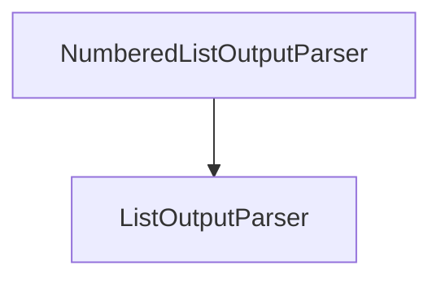

# numbered_list_parser

The `numbered_list_parser` module provides a specialized output parser for extracting items from text formatted as a numbered list. It is part of the `core_output_parsers` module family, specifically designed to handle common list formats.

## Core Functionality

### `NumberedListOutputParser`

This class is responsible for parsing text that is expected to be a numbered list. It extends `ListOutputParser` and uses a regular expression to identify and extract individual items.

**Key Features:**

*   **Pattern-based Parsing**: Utilizes a regular expression (`\d+\.\s([^
]+)`) to match numbered list items, supporting various numbering schemes (e.g., "1. item", "2. another item").
*   **Format Instructions**: Provides clear instructions on the expected numbered list format, which can be useful for guiding Language Models (LLMs) to produce correctly formatted output.
*   **Iterable Parsing**: Offers both a standard `parse` method to return a complete list of strings and a `parse_iter` method for iterating over matches, which can be efficient for large outputs.

**Methods:**

*   `get_format_instructions() -> str`: Returns a string detailing the expected numbered list format.
*   `parse(text: str) -> list[str]`: Parses the input text and returns a list of strings, where each string is an item from the numbered list.
*   `parse_iter(text: str) -> Iterator[re.Match]`: Returns an iterator yielding `re.Match` objects for each numbered list item found in the text.

## Architecture and Component Relationships

The `numbered_list_parser` module is a leaf module within the `core_output_parsers.list_parsers` hierarchy. Its primary component, `NumberedListOutputParser`, inherits from `ListOutputParser`, establishing a clear dependency and promoting code reuse for list parsing functionalities.

<!-- DIAGRAM_JSON
{
    "direction": "TD",
    "nodes": [
        {"id": "numbered_list_output_parser", "label": "NumberedListOutputParser", "type": "component", "link": null},
        {"id": "list_output_parser", "label": "ListOutputParser", "type": "external", "link": "list_parsers.md"}
    ],
    "edges": [
        {"source": "numbered_list_output_parser", "target": "list_output_parser"}
    ],
    "groups": []
}
-->

## How it Fits into the Overall System

This module plays a crucial role in the `core_output_parsers` ecosystem by providing a concrete implementation for parsing numbered lists. It allows other modules and applications to reliably extract structured information from LLM outputs that adhere to a numbered list format. By inheriting from `ListOutputParser`, it integrates seamlessly with other list-parsing mechanisms, contributing to a robust and flexible output parsing framework within the system.
