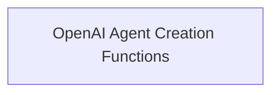

# OpenAI Agent Creators Module

## Introduction
The `openai_agent_creators` module provides core functionalities for creating and managing various types of agents that leverage OpenAI's capabilities, including function calling and tools. This module simplifies the process of integrating powerful AI agents into applications.

## Architecture
This module is structured around a single sub-module that encapsulates the agent creation logic.

<!-- DIAGRAM_JSON
{
    "direction": "TD",
    "nodes": [
        {"id": "agent_creation_functions", "label": "OpenAI Agent Creation Functions", "type": "module", "link": "agent_creation_functions.md"}
    ],
    "edges": [],
    "groups": []
}
-->

## Sub-modules

### [OpenAI Agent Creation Functions](agent_creation_functions.md)
This sub-module contains functions and classes for instantiating different kinds of OpenAI agents, such as those that utilize OpenAI's function calling feature (`create_openai_functions_agent`) and those that work with OpenAI tools (`create_openai_tools_agent`), as well as a multi-function agent (`OpenAIMultiFunctionsAgent`).
